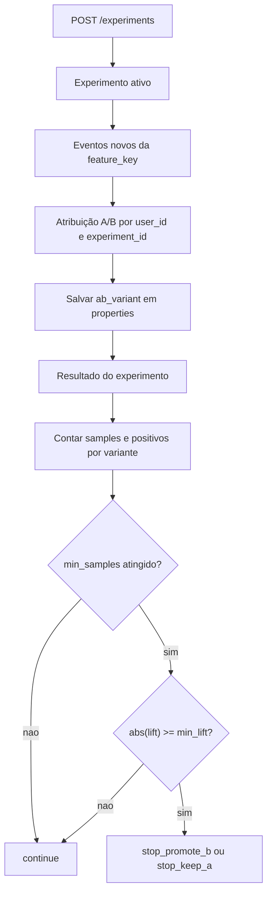
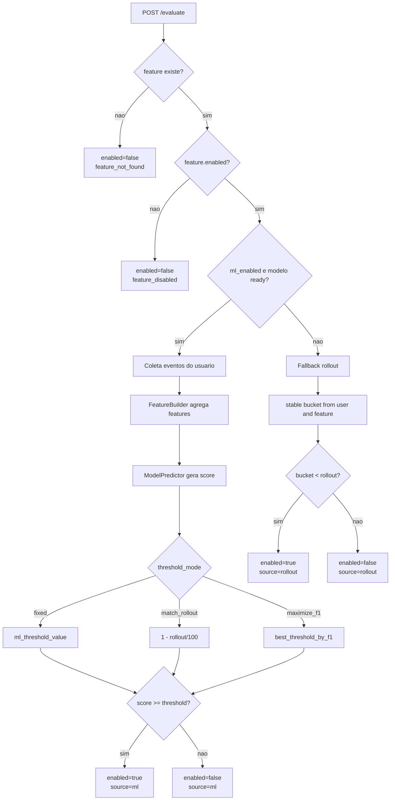
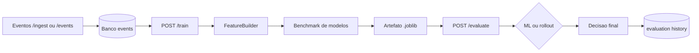

# Adaptive Feature Flags: Relatório Técnico de Machine Learning

## Introdução

### Identificação

- Maria Carolina de Sousa Soares

### Informações Gerais

**Contextualização e justificativa.**  
O projeto Adaptive Feature Flags foi desenvolvido para apoiar a decisão de ativação de features com base no comportamento real de usuários. A proposta articula engenharia de software, telemetria e Machine Learning para tornar a liberação de funcionalidades mais adaptativa, sem abrir mão de um comportamento determinístico quando o modelo não consegue produzir uma decisão confiável.

**Descrição do problema.**  
Em produtos digitais, decidir manualmente quando uma feature deve ser habilitada gera custo operacional, inconsistências e risco de liberar algo para um público inadequado. O problema investigado neste trabalho consiste em transformar eventos de uso em sinais de aprendizado, de modo a prever a propensão do usuário a executar ações relevantes para o produto e, assim, apoiar a decisão de feature flags.

**Descrição da base de dados.**  
A base do projeto é formada por eventos canonicamente estruturados com os campos abaixo, cada um com uma função específica no fluxo do projeto:

| Campo | Função |
| --- | --- |
| `user_id` | identifica o usuário de forma estável e permite agregar comportamento ao nível individual |
| `feature_key` | indica qual feature flag, experimento ou contexto de produto está associado ao evento |
| `event_type` | descreve a ação observada, como exposição, interesse, conversão ou outro sinal de produto |
| `timestamp` | permite ordenar os eventos no tempo e medir recência, frequência e janelas de atividade |
| `properties` | armazena metadados contextuais, como segmento, dispositivo, jornada, variante ou métricas operacionais |

O projeto também utiliza catálogos JSON para gerar dados sintéticos mais realistas por contexto, como checkout e conversão, growth e descoberta, ativação e onboarding, retenção e hábito, e autenticação e cadastro.

Exemplo simplificado de catálogo JSON:

```json
{
  "seed_source": "seed_demo",
  "seed_version": "auth_focus_v1",
  "user_prefix": "auth_user",
  "features": [
    {
      "name": "Magic Link Login",
      "key": "magic_link_login",
      "enabled": true,
      "rollout_percentage": 60,
      "ml_enabled": true,
      "ml_threshold_mode": "match_rollout",
      "ml_threshold_value": 0.22
    }
  ],
  "journeys": {
    "magic_link_login": {
      "page": "login",
      "surface": "passwordless login",
      "exposure_event": "magic_link_prompt_shown",
      "positive_event": "magic_link_requested",
      "conversion_event": "login_success"
    }
  }
}
```

Exemplo de evento canônico persistido:

```json
{
  "user_id": "auth_user_01",
  "feature_key": "magic_link_login",
  "event_type": "magic_link_requested",
  "timestamp": "2026-06-08T09:14:00Z",
  "source": "web_app",
  "properties": {
    "segment": "new_visitor",
    "device": "desktop",
    "journey": "authentication",
    "stage": "intent",
    "seed_source": "seed_demo",
    "seed_version": "auth_focus_v1"
  }
}
```

Esse tipo de registro alimenta o `FeatureBuilder`, que agrega os sinais por usuário para compor o dataset supervisionado do treino. Os catálogos permitem carregar usuários e eventos coerentes para a interface, para o treino e para a avaliação do modelo, preservando consistência entre a narrativa de produto e o comportamento observado.

**Descrição dos objetivos.**  
Os objetivos principais são:

- construir uma base de eventos coerente e útil para demo e treino;
- extrair features agregadas por usuário;
- treinar modelos supervisionados para estimar a propensão a eventos positivos;
- usar o score do modelo para decidir a ativação de features;
- manter um fallback seguro por rollout determinístico quando o ML não estiver pronto.

Do ponto de vista de engenharia, o projeto também busca demonstrar:

- separação entre seed, ingestão, treino e avaliação;
- documentação de taxonomia de eventos;
- reuso de catálogos externos em JSON;
- idempotência do seed;
- observabilidade básica do fluxo de ML.

**Resumo executivo do trabalho.**

Em síntese, o trabalho aborda um problema de decisão manual de ativação de features, estrutura eventos canônicos por usuário e por contexto de produto, aplica classificação supervisionada binária com agregação por usuário e produz como saída o score do modelo, o threshold de decisão e o fallback de rollout. Do ponto de vista aplicado, o resultado é uma simulação realista com treino reproduzível e decisão explicável.

### Resumo do sistema

O sistema organiza-se em camadas: a API trata contratos, o domínio concentra regras de negócio, a infraestrutura cuida de persistência e ML, os catálogos JSON alimentam os cenários sintéticos e a interface permite a verificação visual do comportamento da plataforma.

## Metodologia

### Conceitos de Machine Learning e ciência de dados aplicados

O problema foi modelado como **classificação supervisionada binária**. O objetivo não é prever um valor contínuo, mas estimar a probabilidade de um usuário produzir sinais positivos relevantes para o produto.

Conceitos usados no trabalho:

- **feature engineering**: eventos brutos são agregados por usuário para formar atributos de comportamento;
- **target supervisionado**: o usuário recebe classe `1` se teve ao menos um evento positivo;
- **class imbalance**: os modelos usam `class_weight="balanced"` quando aplicável;
- **train/test split estratificado**: preserva proporção das classes;
- **métricas de classificação**: `accuracy`, `precision`, `recall`, `f1_score`, `roc_auc`;
- **threshold de decisão**: a feature pode usar threshold fixo, alinhado ao rollout, ou otimizado por F1;
- **fallback determinístico**: quando o modelo falha, a decisão retorna ao rollout por usuário e feature.

### Heurísticas de geração da base

Os dados sintéticos não são aleatórios puros. O seed utiliza heurísticas para produzir uma base com características semelhantes às de um produto real:

- cada catálogo gera 50 usuários;
- cada usuário recebe um perfil com probabilidade de sinal positivo;
- cada usuário tem de 1 a 4 dias ativos, dependendo do catálogo;
- cada dia pode ter 1 ou 2 sessões;
- os eventos são espalhados em janelas de dias diferentes para simular histórico;
- a jornada inclui exposição, interesse e conversão, quando faz sentido.

Na prática, o seed busca equilibrar dois objetivos:

- ser previsível e reprodutível, porque usa `random_seed`;
- ser crível, porque distribui eventos por contexto de produto e não apenas por volume bruto.

### Componentes de ML

O `FeatureBuilder` agrega eventos por usuário e gera variáveis numéricas. O `train_from_events` executa o treino supervisionado e o benchmark dos modelos candidatos. O `ModelSerializer` salva e carrega artefatos `.joblib`, o `ModelPredictor` gera o score de probabilidade na avaliação online e o `EvaluationService` decide `enabled` usando ML ou rollout determinístico.

### Taxonomia de eventos

A qualidade do aprendizado depende da interpretação dos eventos. O projeto separa os sinais em grupos:

- `VIEW_EVENT_TYPES`: exposição inicial;
- `INTERMEDIATE_POSITIVE_EVENT_TYPES`: interesse ou progresso intermediário;
- `TERMINAL_POSITIVE_EVENT_TYPES`: conversão final;
- `POSITIVE_EVENT_TYPES`: conjunto de sinais positivos usados no target e na avaliação.

Essa separação contribui para transformar telemetria bruta em sinais mais legíveis para o modelo e para a interpretação do comportamento do usuário.

### Como as features são calculadas

O `FeatureBuilder` transforma eventos em variáveis numéricas por usuário. Algumas fórmulas usadas no pipeline são:

- `positive_rate = positive_events / total_events`
- `events_per_day = total_events / active_days`
- `hours_since_last_event = diferença entre o timestamp de referência e o último evento`

Esses cálculos são importantes porque resumem comportamento em dimensões úteis para classificação:

- volume de uso;
- recência;
- diversidade de features;
- distribuição temporal;
- intensidade de ação positiva.

### Passos para resolver o problema

1. Gerar ou importar eventos no schema canônico.
2. Sincronizar features demo com os catálogos JSON.
3. Agregar eventos por usuário com o `FeatureBuilder`.
4. Construir o dataset supervisionado.
5. Dividir em treino e teste com estratificação.
6. Treinar modelos candidatos.
7. Selecionar o melhor modelo pelo maior `f1_score`.
8. Salvar artefato e metadados do treino.
9. Na avaliação online, usar o score do modelo ou cair para rollout determinístico.

### Heurísticas de decisão e calibração

O fluxo utiliza heurísticas simples, mas relevantes:

- o target é definido por presença de pelo menos um evento positivo;
- a escolha do modelo privilegia `f1_score`, e não apenas acurácia;
- o threshold de decisão pode ser fixo, alinhado ao rollout ou otimizado por F1;
- o fallback determinístico garante que o mesmo `user_id` e `feature_key` resultem sempre na mesma decisão enquanto o rollout não se alterar.

### Modelo e engenharia de software que sustentam o ML

O trabalho não se limita a um experimento de ML isolado. O fluxo depende de componentes de engenharia que viabilizam a reprodução do processo:

- API para persistir eventos, features e decisões;
- scripts de seed para criar cenários realistas e idempotentes;
- catálogos externos em JSON para separar dados de lógica;
- armazenamento do modelo em artefato `.joblib`;
- histórico de treinos e status do modelo;
- dashboard para visualização do efeito das decisões.

Essa separação ajuda a manter o pipeline compreensível e relativamente fácil de evoluir.

### Teste A/B

O projeto também implementa uma camada de experimento A/B-lite para comparar variantes de uma mesma feature com base em uma métrica principal, permitindo observar o impacto de mudanças em um contexto controlado.

Os principais elementos são `feature_key` para identificar a regra testada, `primary_metric_event` como evento de sucesso, `min_samples_per_variant` para garantir volume mínimo, `min_lift` para definir o ganho mínimo e `ab_variant` para marcar se o evento pertence a A ou B.

#### Como o experimento funciona

1. O experimento é criado para uma `feature_key`.
2. Novos eventos dessa feature passam a receber `ab_variant`.
3. A atribuição de variante é determinística por `user_id` e `experiment_id`.
4. O resultado conta apenas eventos novos com `ab_variant`.
5. A decisão final compara a taxa de sucesso entre A e B.

#### Regras de decisão do experimento

O experimento permanece em execução enquanto não atinge `min_samples_per_variant` em ambas as variantes. Quando a amostra mínima é alcançada, o sistema encerra o teste se `abs(lift)` for maior ou igual a `min_lift`, retornando `stop_promote_b` quando B supera A ou `stop_keep_a` quando A supera B. Caso contrário, a decisão permanece `continue`.

#### Diagrama do fluxo A/B



#### Relação com a avaliação de ML

O A/B-lite não substitui o ML. Ele complementa o sistema:

- o ML decide se uma feature deve ficar habilitada para um usuário;
- o experimento mede a performance de uma variante quando o teste está ativo;
- os dois fluxos usam a mesma telemetria, mas respondem perguntas diferentes.

### Como as decisões são calculadas

A decisão final de uma feature para um usuário é calculada em camadas:

1. verificar se a feature existe;
2. verificar se a feature está habilitada;
3. tentar score de ML, se `ml_enabled=true` e existir modelo pronto;
4. se o score existir, comparar `score >= threshold`;
5. se qualquer etapa falhar, usar rollout determinístico.

#### Regra de decisão

| Cenário | Cálculo principal | Saída |
| --- | --- | --- |
| Feature inexistente | n/a | `enabled = false`, `decision_source = feature_not_found` |
| Feature desabilitada | n/a | `enabled = false`, `decision_source = feature_disabled` |
| ML disponível | `enabled = score >= threshold` | `decision_source = ml` |
| Fallback | `bucket = sha256(user_id + ":" + feature_key) % 100` e comparado com `rollout_percentage` | `enabled = bucket < rollout_percentage`, `decision_source = rollout` |

O threshold depende de `ml_threshold_mode`: no modo `fixed`, usa `ml_threshold_value`; em `match_rollout`, aproxima a cobertura com `1 - rollout_percentage / 100`; em `maximize_f1`, usa `best_threshold_by_f1` salvo nas métricas do modelo.

#### Diagrama do fluxo de decisão



### Endpoints principais

O projeto expõe os principais endpoints de saúde, CRUD de features, eventos, ingestão, treino, avaliação, histórico, observabilidade e experimentos. Em conjunto, eles cobrem o fluxo completo de dados, aprendizado e decisão.

#### Diagrama do pipeline do sistema



## Experimentos

### Tipos de testes executados

Os experimentos do projeto foram conduzidos em duas frentes:

- **seed demo**: gera dados sintéticos coerentes por catálogo e, sem argumentos, importa todos os JSON do diretório `dataset/`;
- **treino supervisionado**: compara modelos candidatos no mesmo conjunto de dados.

### Parâmetros avaliados

Os parâmetros e escolhas mais relevantes foram:

- número de usuários por catálogo;
- número de eventos por catálogo;
- distribuição das classes positiva e negativa;
- taxonomia de eventos;
- modelos candidatos;
- threshold de decisão;
- split treino/teste estratificado.

### Resultados observados

Com os 5 catálogos atuais importados pelo seed padrão (`python3 scripts/seed_demo.py`), a base demo gera:

| Indicador | Valor |
| --- | ---: |
| Usuários sintéticos | 250 |
| Eventos totais | 3457 |
| Features únicas | 20 |
| Usuários positivos | 151 |
| Usuários negativos | 99 |
| Taxa positiva por usuário | 60,4% |
| Taxa positiva por evento | 10,9% |
| Média de eventos por usuário | 13,83 |

Esse volume foi considerado adequado para o objetivo do projeto:

- a simulação fica visualmente rica;
- o treino ganha variabilidade suficiente para um MVP;
- a base não fica artificialmente pequena;
- os eventos permanecem coerentes com o contexto do produto.

Do ponto de vista metodológico, a principal descoberta foi que:

- aumentar o número de usuários melhora mais o treino do que inflar eventos repetidos;
- nomes concretos de eventos deixam a base mais realista;
- manter a taxonomia clara melhora interpretabilidade e depuração;
- o modelo aprende melhor quando o target é derivado de sinais positivos bem definidos.

Também ficou claro que a qualidade da simulação melhora quando os catálogos cobrem contextos diferentes, porque isso aumenta a diversidade do dataset sem quebrar a coerência do produto.

### Benchmark de modelos

O treino compara três candidatos:

| Modelo | Característica principal | Papel no benchmark |
| --- | --- | --- |
| `RandomForestClassifier` | lida bem com relações não lineares e ruído moderado | baseline forte e robusto |
| `LogisticRegression` | interpretável e simples | referência linear e fácil de depurar |
| `GradientBoostingClassifier` | captura interações mais complexas | teste de capacidade adicional de ajuste |

O melhor modelo é escolhido pelo maior `f1_score` no conjunto de teste. Essa decisão prioriza equilíbrio entre precisão e recall, o que faz sentido para um problema de ativação de features, em que tanto falso positivo quanto falso negativo são relevantes.

Na prática, o `f1_score` funciona como uma heurística de equilíbrio:

- se o modelo erra pouco os positivos, mas perde muitos casos, o recall cai;
- se o modelo marca demais como positivo, a precisão cai;
- o F1 penaliza os dois extremos e ajuda a comparar candidatos com comportamento diferente.

### Parâmetros de treino relevantes

| Parâmetro | Valor / heurística | Papel |
| --- | --- | --- |
| Split | `train_test_split(..., stratify=y)` | Mantém a proporção das classes no treino e no teste |
| Semente | `random_state=42` | Reprodutibilidade do benchmark |
| Balanceamento | `class_weight="balanced"` quando aplicável | Reduz efeito de desbalanceamento |
| Threshold | `fixed`, `match_rollout` ou `maximize_f1` | Ajusta a sensibilidade da decisão online |
| Fallback | hash estável de `user_id` + `feature_key` | Mantém decisão consistente quando ML falha |
| Calibração | busca em threshold de `0.05` a `0.95` | Estima `best_threshold_by_f1` |

No ajuste de threshold, o trainer também procura o melhor ponto entre `0.05` e `0.95`, em passos de `0.05`, para estimar `best_threshold_by_f1`. Isso permite uma calibração simples e explicável para a decisão online.

## Conclusão

Sim, o trabalho atendeu aos objetivos propostos.

O projeto conseguiu:

- organizar uma base de eventos coerente;
- estruturar uma taxonomia útil para ML;
- transformar eventos em features por usuário;
- treinar modelos supervisionados;
- registrar métricas e benchmark;
- aplicar decisão online com fallback seguro;
- manter o sistema útil para avaliação visual e técnica.

Como aprendizado principal, o trabalho mostrou que a qualidade do ML aqui depende mais da organização dos dados e da interpretabilidade dos sinais do que da complexidade do modelo em si. Em resumo, o projeto valida um fluxo completo de machine learning aplicado à decisão de produto, com boa engenharia de suporte e espaço claro para evolução futura.
