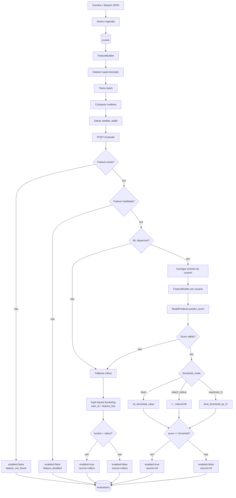
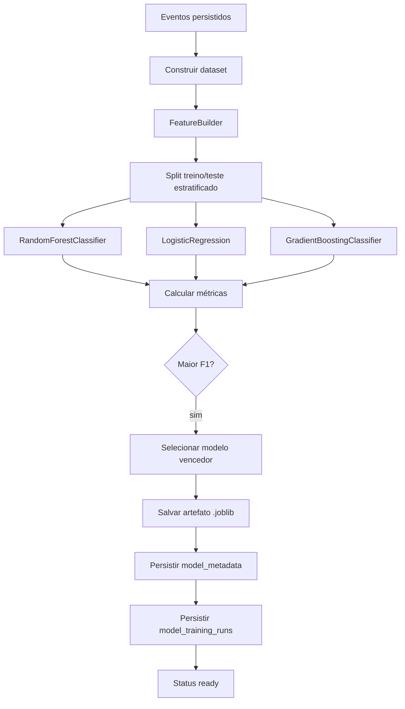
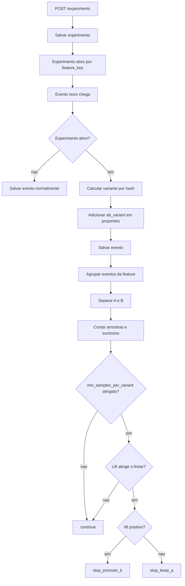

# Adaptive Feature Flags: Relatório Técnico de Machine Learning

# Introdução

Este trabalho apresenta o projeto Adaptive Feature Flags, uma API experimental que combina liberação gradual de funcionalidades, ingestão de eventos e machine learning para tomar decisões por usuário. A proposta é transformar sinais de uso em uma decisão operacional: habilitar ou não uma feature, mantendo fallback determinístico por rollout quando o modelo não está pronto ou não consegue inferir com confiança.

A solução também cobre os fluxos de produto que sustentam essa decisão: seed de dados sintéticos, registro de eventos, treino batch, avaliação online em tempo de requisição e experimentação A/B. A ideia é mostrar o ciclo completo, do dado bruto até a liberação da feature.

# Identificação

- Maria Carolina de Sousa Soares

# Informações Gerais

## Contextualização e justificativa

Em produtos digitais, liberar funcionalidades manualmente aumenta custo operacional, cria inconsistências e expõe usuários a riscos desnecessários. O Adaptive Feature Flags foi pensado para estudar uma alternativa orientada a eventos, em que o comportamento do usuário alimenta tanto o processo de decisão quanto o aprendizado do modelo.

A proposta aproxima duas necessidades reais de engenharia de software:

- controle de rollout com segurança;
- uso de machine learning para apoiar decisões de produto.

## Problema

O problema pode ser resumido assim: a partir do histórico de eventos de um usuário, estimar sua propensão a produzir sinais positivos relevantes para uma feature e usar esse score para decidir a ativação da funcionalidade.

Na prática, a avaliação responde a esta pergunta:

> este usuário tem comportamento compatível com habilitar a feature agora?

Por isso, o problema foi tratado como classificação binária por usuário, e não como previsão contínua de volume ou tempo.

## Base de dados

A base do projeto nasce em catálogos JSON localizados em `dataset/`. Esses arquivos não são apenas configuração: eles descrevem o contexto do produto, orientam o seed e garantem que os eventos gerados façam sentido para o treinamento supervisionado.

Os catálogos atuais cobrem cinco contextos principais:

- `checkout`: jornada de compra, checkout e decisão de conversão;
- `growth`: descoberta, aquisição e ativação de interesse;
- `retention`: retorno recorrente, hábito e continuidade de uso;
- `activation`: onboarding, primeiros passos e primeiro valor;
- `auth`: login, cadastro e recuperação de acesso.

Cada catálogo é definido por uma estrutura única de campos, detalhada na tabela abaixo:

| Campo | Significado técnico |
| --- | --- |
| `seed_source` | origem lógica do catálogo, útil para rastreabilidade e auditoria |
| `seed_version` | versão do catálogo, útil para evolução controlada do dataset |
| `user_prefix` | prefixo dos usuários sintéticos, usado para evitar colisões entre catálogos |
| `seed_anchor` | data inicial de referência dos eventos |
| `seed_window_days` | janela temporal em que os eventos serão distribuídos |
| `random_seed` | semente determinística do gerador pseudoaleatório |
| `features` | regras e features que precisam existir no sistema |
| `activities` | atividades canônicas usadas na UI, no seed e na avaliação |
| `profiles` | perfis de usuários, com probabilidades e padrões de comportamento |
| `journeys` | mapeamento de jornada por feature, definindo exposição, intenção e conversão |

Essa estrutura faz a ponte entre produto e machine learning:

- `features` define quais funcionalidades podem ser avaliadas;
- `journeys` define quais eventos representam a jornada do usuário;
- `profiles` define como o comportamento varia entre usuários;
- `seed_anchor`, `seed_window_days` e `random_seed` determinam a parte temporal e a repetibilidade da base.

O seed transforma esse catálogo em dados sintéticos reais para o projeto. Ele lê o JSON, cria usuários, distribui sessões no tempo e grava eventos coerentes com a jornada descrita.

Depois do seed, os eventos já aparecem com os campos centrais abaixo:

| Campo | Papel no dataset |
| --- | --- |
| `user_id` | identifica o usuário e permite agregação individual |
| `feature_key` | relaciona o evento a uma feature ou jornada do produto |
| `event_type` | descreve a ação observada, como visualização, interesse ou conversão |
| `timestamp` | permite medir recência, frequência e ordem temporal |
| `source` | indica a origem do evento |
| `properties` | concentra metadados de contexto como segmento, dispositivo, jornada e variante |

O seed é determinístico por `random_seed` e idempotente por identidade lógica do evento. Na prática, isso significa que o mesmo catálogo produz sempre o mesmo conjunto de eventos, desde que a entrada não mude.

O banco local, na execução atual, registra também:

- `activities`
- `features`
- `events`
- `experiments`
- `model_metadata`
- `model_training_runs`
- `evaluations`

### Como o evento é representado

Depois que o catálogo é carregado, o seed grava eventos individuais. Cada evento é a unidade bruta observada pelo sistema; ele ainda não é dado de ML, mas será agregado depois.

| Campo | O que representa |
| --- | --- |
| `user_id` | usuário que executou a ação |
| `feature_key` | feature ou jornada relacionada à ação |
| `event_type` | ação em si, como `view`, `clicked`, `requested` ou `completed` |
| `timestamp` | instante exato em que o evento ocorreu |
| `source` | canal ou origem técnica do evento |
| `properties` | contexto adicional do evento em formato estruturado |

### Como o `timestamp` é utilizado

O `timestamp` é um dos campos mais importantes do projeto porque permite transformar uma sequência de eventos em comportamento ao longo do tempo. Ele é usado para:

- ordenar os eventos do usuário;
- identificar o evento mais recente;
- calcular `active_days`;
- calcular `hours_since_last_event`;
- calcular `avg_hour`;
- calcular `avg_day_of_week`;
- simular recorrência e recência de uso;
- manter consistência temporal entre seed, treino e avaliação.

Esse campo tira o sistema de uma visão estática e o coloca em uma visão temporal do comportamento. Na avaliação, ele ajuda a encontrar a atividade mais recente; no treino, permite criar agregações temporais por usuário.

### Como o `latency_ms` é utilizado

O campo `latency_ms` aparece dentro de `properties` e representa uma latência sintética associada ao evento. Ele não entra como feature principal no modelo atual, mas cumpre funções importantes:

- deixa os eventos mais realistas;
- ajuda a validar ingestão e serialização de metadados;
- simula diferenças entre leitura, clique e conversão;
- permite observar se o pipeline preserva informações auxiliares;
- apoia futuras extensões para análise de performance e UX.

Em termos simples: `timestamp` mostra quando algo aconteceu; `latency_ms` mostra a característica temporal da interação. São campos diferentes e complementares.

### Como o `properties` é usado

O campo `properties` concentra o contexto do evento. Sem ele, cada linha seria apenas um registro solto; com ele, o evento ganha narrativa de produto. Os campos mais relevantes são:

- `catalog_name`: identifica o catálogo que gerou o evento;
- `seed_source`: mantém rastreabilidade da origem do dado;
- `seed_version`: indica qual versão do catálogo gerou o evento;
- `journey`: nome lógico da jornada do produto;
- `stage`: etapa da jornada, como awareness, exposure ou conversion;
- `segment`: segmento do usuário;
- `device`: dispositivo usado;
- `country`: país do usuário;
- `channel`: canal de aquisição ou acesso;
- `session_id`: identificador da sessão;
- `user_alias`: alias legível do usuário;
- `page`: página do produto associada ao evento;
- `surface`: superfície de interface relacionada ao evento;
- `funnel_stage`: estágio do funil;
- `flag_variant`: variante sintética controlada pelo seed;
- `latency_ms`: latência sintética;
- `step_index`: índice da sessão no fluxo;
- `day_offset`: deslocamento temporal relativo ao `seed_anchor`;
- `order_value`: valor da compra quando existe conversão;
- `currency`: moeda do valor financeiro.

Com isso, a base deixa de ser apenas uma coleção de eventos e passa a representar jornadas de produto contextualizadas.

Com a base descrita, a próxima etapa é explicá-la como entrada de machine learning: os eventos brutos viram features, o target é construído e os modelos passam a ser treinados sobre uma visão agregada por usuário.

## Objetivos

Os objetivos principais do trabalho são:

- estruturar uma base de eventos útil para aprendizado de máquina;
- transformar eventos brutos em features agregadas por usuário;
- treinar modelos supervisionados para prever comportamento positivo;
- usar o score do modelo para apoiar a decisão de feature flags;
- manter um fallback seguro por rollout determinístico;
- registrar os resultados para leitura, auditoria e comparação.

Em termos de produto, o projeto também busca:

- demonstrar um fluxo event-driven completo;
- separar claramente seed, ingestão, treino e avaliação;
- apoiar experimentação e análise de variantes;
- manter o sistema simples o suficiente para evoluir depois.

# Metodologia

## Conceitos de machine learning aplicados

O problema foi modelado como **classificação supervisionada binária**. Cada usuário recebe uma classe final com base no comportamento observado no histórico de eventos.

Essa decisão cria a ponte entre produto e ML: os eventos deixam de ser apenas registros operacionais e passam a ser sinais explicativos de comportamento, que podem ser agregados, rotulados e usados para inferência supervisionada.

Conceitos usados no projeto:

- **feature engineering**: os eventos são agregados por usuário para formar atributos numéricos;
- **target supervisionado**: a classe do usuário é derivada de eventos positivos por uma **regra de rotulagem heurística**; em termos mais acadêmicos, isso pode ser descrito como **proxy label** ou **weak supervision**;
- **desbalanceamento leve de classes**: o treino usa `class_weight="balanced"` em alguns modelos;
- **split estratificado**: a divisão treino/teste preserva a proporção das classes;
- **métricas de classificação**: `accuracy`, `precision`, `recall`, `f1_score` e `roc_auc`;
- **otimização de threshold**: a decisão online pode usar corte fixo, corte alinhado ao rollout ou o melhor corte por F1; isso corresponde a **threshold tuning**;
- **fallback determinístico**: se o modelo falhar, a decisão volta para o rollout percentual por **hash-based bucketing** com atribuição estável.

Como a base é tabular e agregada por usuário, modelos clássicos de classificação foram uma escolha mais apropriada do que redes neurais mais complexas. O foco aqui é previsibilidade, interpretação e integração com o produto.

## Fluxo completo do produto

O fluxo principal é:

1. os catálogos JSON em `dataset/` são carregados pelo seed;
2. o seed cria `activities`, `features` e eventos sintéticos;
3. os eventos são persistidos na tabela `events`;
4. o treino batch lê esses eventos e monta o dataset supervisionado;
5. o `FeatureBuilder` agrega sinais por usuário;
6. o treino compara modelos candidatos e escolhe o melhor por `f1_score`;
7. o artefato do modelo é salvo em disco;
8. a avaliação online em `/evaluate` consulta o modelo pronto;
9. se o score existir, a decisão usa ML;
10. se não existir, o sistema cai para rollout determinístico;
11. a decisão final é registrada em `evaluations`.

O diagrama abaixo resume a decisão online completa, que é a parte mais importante do sistema na perspectiva de machine learning:

## Variável alvo utilizada

A variável alvo usada no treinamento é `target`.

Definição:

- `target = 1` se o usuário teve pelo menos um evento positivo;
- `target = 0` caso contrário.

Em termos de implementação, o alvo é derivado de `POSITIVE_EVENT_TYPES`, que reúne sinais de valor do produto, como exposição útil, interesse e conversão. Isso faz o problema ficar mais alinhado ao uso real da feature flag: o sistema tenta prever se o usuário apresenta comportamento positivo suficiente para receber a funcionalidade.

Do ponto de vista técnico, essa definição é uma **regra de rotulagem heurística**. Ela funciona como um **proxy label** porque usa um critério operacional observável para aproximar o conceito de “usuário com comportamento positivo”.

## Como as variáveis são calculadas

O `FeatureBuilder` transforma o histórico de eventos em uma linha por usuário. As features geradas pelo builder incluem:

- `total_events`
- `positive_events`
- `view_events`
- `cart_events`
- `purchase_events`
- `unique_features`
- `active_days`
- `avg_hour`
- `avg_day_of_week`
- `hours_since_last_event`
- `events_per_day`
- `positive_rate`
- `target`

As fórmulas principais são:

- `positive_rate = positive_events / total_events`
- `events_per_day = total_events / active_days`
- `hours_since_last_event = (reference_timestamp - last_seen) em horas`
- `target = 1` quando `positive_events > 0`

### Taxonomia de eventos

A qualidade do aprendizado depende de classificar corretamente os eventos. O projeto organiza os sinais em grupos que representam estágios diferentes da jornada do usuário:

| Grupo | Significado | Exemplos | Uso em ML |
| --- | --- | --- | --- |
| `VIEW_EVENT_TYPES` | exposição inicial ou awareness | `view`, `checkout_upsell_shown`, `onboarding_step_shown` | alimenta `view_events` e ajuda a medir abertura ao fluxo |
| `INTERMEDIATE_POSITIVE_EVENT_TYPES` | interesse intermediário ou intenção | `checkout_upsell_clicked`, `pricing_details_opened`, `hero_cta_clicked` | alimenta `cart_events` e mostra avanço no funil |
| `TERMINAL_POSITIVE_EVENT_TYPES` | conversão final ou ação concluída | `transaction`, `purchase_completed`, `subscription_upgraded` | alimenta `purchase_events` e captura o objetivo final |
| `POSITIVE_EVENT_TYPES` | conjunto completo de sinais positivos relevantes | união dos grupos acima + eventos como `addtocart` | define o `target` e agrega os sinais que o modelo considera positivos |

Essa taxonomia separa o comportamento do usuário em níveis de intenção. Primeiro o evento mostra exposição, depois interesse, e por fim conversão. Essa separação melhora a leitura do dataset e ajuda o modelo a não depender de um único tipo de ação.

Na fase de treino atual, o modelo usa este subconjunto de variáveis:

- `unique_features`
- `active_days`
- `avg_hour`
- `avg_day_of_week`
- `hours_since_last_event`
- `events_per_day`

Essas colunas foram escolhidas porque resumem comportamento de forma compacta, sem depender de alta dimensionalidade.

## Relação entre as variáveis

As variáveis têm interpretações complementares:

- `positive_events` está diretamente ligado ao `target`;
- `positive_rate` mostra a proporção de comportamento positivo;
- `unique_features` mede diversidade de uso;
- `active_days` mede recorrência;
- `hours_since_last_event` mede recência;
- `events_per_day` mede intensidade;
- `avg_hour` e `avg_day_of_week` capturam padrão temporal de uso.

No conjunto sintético do projeto, usuários mais engajados tendem a apresentar:

- mais eventos positivos;
- maior número de dias ativos;
- mais diversidade de features;
- menor recência do último evento;
- maior intensidade de uso.

Isso cria uma relação plausível entre comportamento e probabilidade de ativação da feature.

## Modelos escolhidos e por que

O benchmark do treino compara três modelos:

- `RandomForestClassifier`
- `LogisticRegression`
- `GradientBoostingClassifier`

Motivos da escolha:

- **Random Forest**: lida bem com relações não lineares e é robusto a ruído;
- **Logistic Regression**: serve como baseline interpretável e rápido;
- **Gradient Boosting**: testa uma capacidade maior de ajuste em interações entre variáveis.

O vencedor é definido pelo maior `f1_score` no conjunto de teste. Essa métrica foi escolhida porque o problema exige equilíbrio entre precisão e recall. Em feature flags, tanto falso positivo quanto falso negativo importam:

- falso positivo pode liberar a feature para quem não deveria;
- falso negativo pode impedir uma liberação útil.

O `f1_score` ajuda a equilibrar essas duas falhas.

### Fluxo de escolha do modelo

O modelo que vai liberar a feature não é escolhido manualmente; ele passa por um pipeline de treino, comparação e persistência:

Nesse fluxo:

- todos os candidatos usam o mesmo dataset supervisionado;
- a divisão treino/teste é estratificada para manter a proporção das classes;
- o melhor modelo é o que obtém maior `f1_score`;
- o artefato só passa a ser usado em `/evaluate` quando o status fica `ready` e o `artifact_path` existe.

## Decisão online e fallback

Na avaliação em `/evaluate`, a regra é:

1. verificar se a feature existe;
2. verificar se está habilitada;
3. tentar usar o modelo se `ml_enabled=true` e o artefato estiver pronto;
4. calcular o score do usuário;
5. comparar score com threshold;
6. se algo falhar, usar rollout determinístico.

O rollout usa um **bucket estável** baseado em `sha256(user_id:feature_key) % 100`, garantindo que o mesmo usuário receba a mesma decisão enquanto o percentual não mudar. O nome técnico desse padrão é **hash-based bucketing** ou **deterministic assignment**.

O threshold da feature pode seguir três modos:

- `fixed`: usa `ml_threshold_value`;
- `match_rollout`: aproxima o corte pela cobertura do rollout, uma forma de **threshold calibration**;
- `maximize_f1`: usa o melhor threshold encontrado no treino, resultado do **threshold tuning**.

Esse fluxo mostra o ciclo completo de decisão: o sistema treina, escolhe o melhor modelo, salva o artefato, aplica inferência em `/evaluate` e só então decide se libera a feature. O modelo não é uma peça isolada; ele é a etapa intermediária entre o histórico do usuário e a decisão operacional.

## Explicação dos fluxos auxiliares do produto

Além do ML principal, o projeto também possui experimentação A/B. Nesse fluxo, o sistema registra `ab_variant` em eventos quando há experimento ativo, mede a métrica principal e calcula lift entre variantes. Esse mecanismo não substitui o ML da feature flag, mas complementa a análise de produto.

### Fluxo de experimentação A/B

Leitura do fluxo:

- `ab_variant` é salvo junto ao evento apenas quando existe experimento ativo para a `feature_key`;
- a atribuição de variante é estável por `user_id` e por `experiment_id`; na implementação atual, isso é feito por **hash-based bucketing** com `sha256(f"{experiment_id}:{user_id}") % 100`;
- a avaliação usa a métrica principal definida em `primary_metric_event`;
- o experimento só decide quando cada variante atinge `min_samples_per_variant`;
- a decisão final compara o `lift` entre B e A.

As fórmulas centrais são:

- `taxa_de_sucesso = eventos_de_sucesso / amostras`
- `lift_B_vs_A = taxa_de_sucesso_B - taxa_de_sucesso_A`

O A/B entra como uma camada complementar de leitura do produto. Enquanto o modelo supervisionado decide a liberação por usuário, o experimento compara variantes de uma mesma feature para responder se uma mudança específica performa melhor que a outra.

# Experimentos (Opcional)

## Tipos de testes executados

Os testes mais relevantes no projeto foram:

- benchmark dos modelos candidatos no mesmo dataset;
- calibração de threshold entre `0.05` e `0.95` em passos de `0.05`;
- divisão treino/teste estratificada;
- avaliação do fallback determinístico;
- persistência do histórico de treino e avaliação.

Cada um desses testes verifica uma parte do encadeamento do sistema: a geração da base sintética, a consistência das features, a qualidade do classificador, a estabilidade da decisão online e a leitura de variante no fluxo experimental.

## Parâmetros avaliados

Os parâmetros observados no treinamento foram:

- `accuracy`
- `precision`
- `recall`
- `f1_score`
- `roc_auc`
- matriz de confusão
- `best_threshold_by_f1`
- `model_version`
- `artifact_path`

Na última execução registrada, o treino usou:

- `total_events = 1650`
- `unique_users = 251`
- `positive_events = 321`
- `positive_rate = 60.16%`
- `train_rows = 200`
- `test_rows = 51`

Esse volume é suficiente para um MVP acadêmico porque oferece diversidade sem perder rastreabilidade.

## Resultados

Na execução atual, o modelo selecionado foi `logistic_regression`, versão `v7`, salvo em `storage/models/v7.joblib`.

### Benchmark dos modelos

| Modelo | Accuracy | Precision | Recall | F1 | ROC AUC | Best threshold |
| --- | ---: | ---: | ---: | ---: | ---: | ---: |
| `random_forest` | 0.7255 | 0.7429 | 0.8387 | 0.7879 | 0.8065 | 0.40 |
| `logistic_regression` | 0.7647 | 0.8519 | 0.7419 | 0.7931 | 0.8581 | 0.30 |
| `gradient_boosting` | 0.7059 | 0.7222 | 0.8387 | 0.7761 | 0.8016 | 0.25 |

### Métricas do modelo selecionado

| Métrica | Valor |
| --- | ---: |
| Accuracy | 0.7647 |
| Precision | 0.8519 |
| Recall | 0.7419 |
| F1 | 0.7931 |
| ROC AUC | 0.8581 |
| Best threshold by F1 | 0.30 |

### Matriz de confusão

| TN | FP | FN | TP |
| ---: | ---: | ---: | ---: |
| 16 | 4 | 8 | 23 |

## Interpretação dos resultados

A `LogisticRegression` foi escolhida porque apresentou o melhor `f1_score` e também o melhor `roc_auc` entre os três modelos. Isso indica que ela separou melhor as classes positivas e negativas na base atual.

Leituras importantes desses números:

- a precision alta indica que o modelo erra pouco quando prevê positivo;
- o recall menor que a precision mostra que ainda existem positivos não detectados;
- o threshold ótimo de `0.30` sugere que o corte padrão `0.50` seria conservador demais;
- a classe positiva não é extrema, então o uso de pesos balanceados ajuda a estabilizar o treino;
- o modelo linear foi suficiente para a estrutura do dataset, que já traz features agregadas e informativas.

Do ponto de vista do produto, o resultado é bom porque o sistema não depende apenas do modelo:

- se a inferência funcionar, a feature é decidida por ML;
- se não funcionar, o fallback por rollout mantém o sistema operacional;
- o histórico de treino e avaliação torna o processo auditável.

## Observabilidade

O projeto mantém rastreio básico dos eventos de ML e produto. Na base local atual existem:

- `1` registro em `model_metadata`;
- `7` execuções em `model_training_runs`;
- `24` decisões em `evaluations`.

Isso ajuda a demonstrar evolução do sistema durante a apresentação.

# Conclusão

Sim, o trabalho atendeu aos objetivos propostos.

A narrativa técnica do projeto fica encadeada assim: primeiro o sistema define a base sintética e o significado dos eventos; depois converte os eventos em features agregadas e rotuladas; em seguida compara modelos supervisionados e escolhe o melhor; por fim, usa esse modelo para tomar decisões de produto com fallback seguro e com suporte a experimentação.

O projeto conseguiu:

- estruturar uma base sintética coerente;
- transformar eventos em features por usuário;
- treinar e comparar modelos supervisionados;
- selecionar o melhor modelo por métrica adequada ao problema;
- aplicar decisão online com fallback seguro;
- integrar ML com o fluxo de produto e com experimentação.

Como aprendizado principal, o trabalho mostra que, nesse tipo de aplicação, a qualidade da decisão depende mais da organização dos dados, da escolha do alvo e da interpretação das métricas do que da complexidade do modelo. O resultado final é um fluxo completo de machine learning aplicado a feature flags, com explicação clara, rastreabilidade e espaço para evolução futura.
