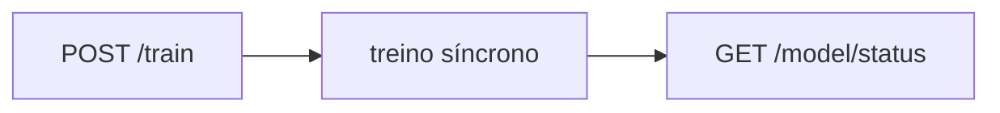

# Training e Model Status

## `POST /train`

Executa treino síncrono do modelo com base nos eventos persistidos.

Exemplo de resposta:

```json
{
  "status": "ready",
  "model_name": "random_forest",
  "model_version": "v1",
  "artifact_path": "storage/models/v1.joblib",
  "trained_at": "2026-05-23T12:10:00Z",
  "metrics": {
    "accuracy": 0.82,
    "f1_score": 0.79
  },
  "process": {
    "total_events": 100000,
    "unique_users": 30000,
    "positive_events": 12000,
    "duration_ms": 4200,
    "feature_columns": [
      "unique_features",
      "active_days"
    ]
  }
}
```

## `GET /model/status`

Retorna estado atual do último modelo treinado.

Exemplo:

```json
{
  "status": "ready",
  "model_name": "random_forest",
  "model_version": "v1",
  "trained_at": "2026-05-23T12:10:00Z",
  "metrics": {
    "accuracy": 0.82,
    "f1_score": 0.79
  }
}
```

## Fluxo dos endpoints de treino


