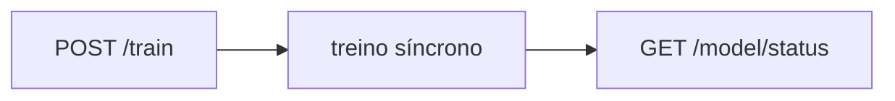

# Training e Model Status

## `POST /train`

Executa treino síncrono do modelo com base nos eventos persistidos.

Exemplo de resposta:

```json
{
  "status": "ready",
  "model_name": "random_forest",
  "model_version": "v1",
  "artifact_path": "storage/models/v1.joblib",
  "trained_at": "2026-05-23T12:10:00Z",
  "metrics": {
    "accuracy": 0.82,
    "precision": 0.81,
    "recall": 0.77,
    "f1_score": 0.79,
    "roc_auc": 0.86,
    "confusion_matrix": {
      "true_negative": 5000,
      "false_positive": 900,
      "false_negative": 1100,
      "true_positive": 3000
    }
  },
  "process": {
    "total_events": 100000,
    "unique_users": 30000,
    "positive_events": 12000,
    "duration_ms": 4200,
    "feature_columns": [
      "unique_features",
      "active_days"
    ],
    "benchmark": [
      {"model_name": "random_forest", "f1_score": 0.79},
      {"model_name": "logistic_regression", "f1_score": 0.74},
      {"model_name": "gradient_boosting", "f1_score": 0.76}
    ],
    "dataset_profile": {
      "rows": 30000,
      "train_rows": 24000,
      "test_rows": 6000,
      "positive_rate": 0.4,
      "class_distribution": {"0": 18000, "1": 12000}
    }
  }
}
```

## `GET /model/status`

Retorna estado atual do último modelo treinado.

Exemplo:

```json
{
  "status": "ready",
  "model_name": "random_forest",
  "model_version": "v1",
  "trained_at": "2026-05-23T12:10:00Z",
  "metrics": {
    "accuracy": 0.82,
    "f1_score": 0.79
  }
}
```

## `GET /model/runs`

Retorna histórico recente de treinos com snapshot completo (métricas, benchmark, perfil do dataset e política de fallback/threshold).

## Fluxo dos endpoints de treino


