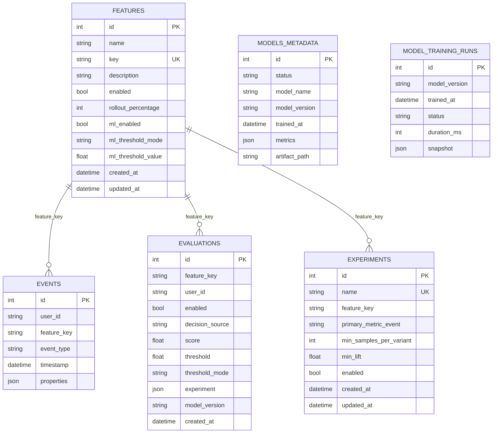

# Esquema do Banco de Dados

Este documento descreve a estrutura física do banco SQLite do projeto, com foco nas tabelas criadas, seus atributos e as relações lógicas usadas pelo sistema.

## Visão Geral

O banco é criado a partir dos models em `app/infrastructure/db/models.py` e contém as entidades persistidas pelo fluxo de features, eventos, avaliação, treino, modelo e experimentos.

Observação importante: o projeto não define foreign keys explícitas no SQLite. As relações entre tabelas são lógicas e acontecem por campos como `feature_key`, `user_id` e `model_version`.
`model_metadata` e `model_training_runs` não possuem relacionamento físico direto; a primeira guarda o estado atual do modelo e a segunda guarda o histórico das execuções de treino.

## Tabelas

### 1. `features`

Armazena as feature flags cadastradas na plataforma.

| Atributo | Tipo | Restrições | Finalidade |
| --- | --- | --- | --- |
| `id` | `int` | PK, autoincrement | Identificador interno da feature |
| `name` | `string(100)` | não nulo | Nome legível da feature |
| `key` | `string(50)` | não nulo, índice, único | Chave estável usada na API e nos eventos |
| `description` | `string(500)` | opcional | Descrição funcional da feature |
| `enabled` | `bool` | não nulo | Define se a feature está ativa |
| `rollout_percentage` | `int` | não nulo | Percentual de rollout determinístico |
| `ml_enabled` | `bool` | não nulo | Habilita decisão por ML |
| `ml_threshold_mode` | `string(30)` | não nulo | Política de threshold da decisão |
| `ml_threshold_value` | `float` | não nulo | Threshold fixo quando aplicável |
| `created_at` | `datetime` | não nulo | Data de criação |
| `updated_at` | `datetime` | não nulo | Data da última atualização |

### 2. `events`

Armazena os eventos canônicos coletados da plataforma e da ingestão em lote.

| Atributo | Tipo | Restrições | Finalidade |
| --- | --- | --- | --- |
| `id` | `int` | PK, autoincrement | Identificador interno do evento |
| `user_id` | `string(100)` | não nulo, índice | Identifica o usuário dono do evento |
| `feature_key` | `string(50)` | não nulo, índice | Relaciona o evento à feature ou contexto |
| `event_type` | `string(50)` | não nulo, índice | Tipo do evento observado |
| `timestamp` | `datetime` | não nulo, índice | Momento do evento |
| `properties` | `json` | não nulo | Metadados contextuais do evento |

### 3. `evaluations`

Registra o histórico de decisões produzidas pelo endpoint `/evaluate`.

| Atributo | Tipo | Restrições | Finalidade |
| --- | --- | --- | --- |
| `id` | `int` | PK, autoincrement | Identificador da decisão |
| `feature_key` | `string(50)` | não nulo, índice | Feature avaliada |
| `user_id` | `string(100)` | não nulo, índice | Usuário avaliado |
| `enabled` | `bool` | não nulo | Resultado final da decisão |
| `decision_source` | `string(50)` | não nulo, índice | Origem da decisão (`ml`, `rollout`, etc.) |
| `score` | `float` | opcional | Score do modelo quando disponível |
| `threshold` | `float` | opcional | Threshold usado na decisão |
| `threshold_mode` | `string(30)` | opcional | Modo de threshold aplicado |
| `experiment` | `json` | opcional | Contexto A/B-lite associado |
| `model_version` | `string(50)` | opcional | Versão do modelo usado |
| `created_at` | `datetime` | não nulo, índice | Momento em que a decisão foi registrada |

### 4. `model_metadata`

Armazena o estado atual do modelo treinado e seus metadados principais.

| Atributo | Tipo | Restrições | Finalidade |
| --- | --- | --- | --- |
| `id` | `int` | PK | Identificador fixo do registro de status |
| `status` | `string(30)` | não nulo | Estado do modelo (`ready`, etc.) |
| `model_name` | `string(200)` | opcional | Nome do modelo vencedor |
| `model_version` | `string(50)` | opcional | Versão corrente do modelo |
| `trained_at` | `datetime` | opcional | Data do último treino bem-sucedido |
| `metrics` | `json` | opcional | Métricas do treino atual |
| `artifact_path` | `string(500)` | opcional | Caminho do artefato `.joblib` |

### 5. `model_training_runs`

Guarda o histórico de execuções de treino para governança e auditoria.

| Atributo | Tipo | Restrições | Finalidade |
| --- | --- | --- | --- |
| `id` | `int` | PK, autoincrement | Identificador da execução |
| `model_version` | `string(50)` | não nulo, índice | Versão treinada |
| `trained_at` | `datetime` | não nulo, índice | Data do treino |
| `status` | `string(30)` | não nulo | Resultado do processo |
| `duration_ms` | `int` | opcional | Tempo total do treino |
| `snapshot` | `json` | não nulo | Resumo completo da execução |

### 6. `experiments`

Registra experimentos A/B-lite associados a uma feature.

| Atributo | Tipo | Restrições | Finalidade |
| --- | --- | --- | --- |
| `id` | `int` | PK, autoincrement | Identificador do experimento |
| `name` | `string(120)` | não nulo, único, índice | Nome do experimento |
| `feature_key` | `string(50)` | não nulo, índice | Feature associada |
| `primary_metric_event` | `string(50)` | não nulo | Evento que define o sucesso |
| `min_samples_per_variant` | `int` | não nulo | Volume mínimo por variante |
| `min_lift` | `float` | não nulo | Diferença mínima para encerrar |
| `enabled` | `bool` | não nulo | Controle de ativação do experimento |
| `created_at` | `datetime` | não nulo | Data de criação |
| `updated_at` | `datetime` | não nulo | Data da última atualização |

## Relações lógicas

As relações abaixo não são foreign keys formais no SQLite, mas representam como o sistema usa os dados:

- `features.key` se relaciona com `events.feature_key`, `evaluations.feature_key` e `experiments.feature_key`;
- `events.user_id` e `evaluations.user_id` permitem agregação e rastreamento por usuário;
- `model_metadata` e `model_training_runs` representam governança do ciclo de treino;
- `experiments` usa a telemetria de `events` para calcular `ab_variant`, taxa de sucesso e lift.

## Leitura rápida do banco

Se o objetivo for entender rapidamente o banco do projeto, a sequência mais útil é:

1. `features` define o que pode ser ativado.
2. `events` registra o comportamento dos usuários.
3. `model_metadata` e `model_training_runs` guardam o estado do ML.
4. `evaluations` registra cada decisão individual.
5. `experiments` complementa o sistema com A/B-lite.
