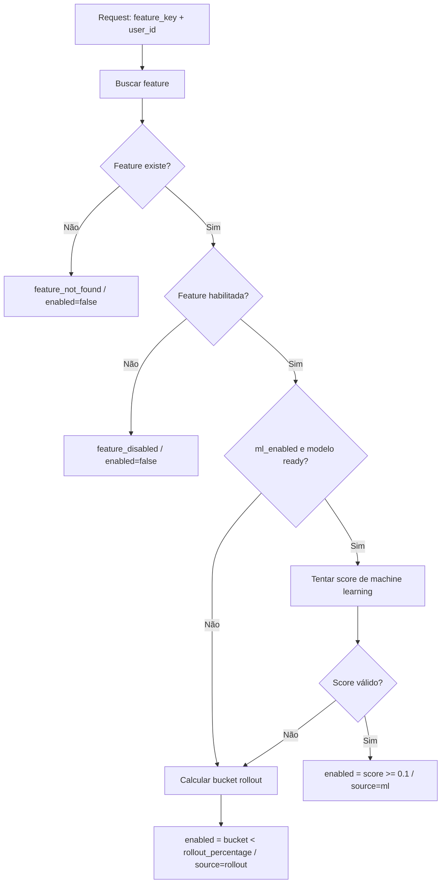

# Fluxo de Decisão de Avaliação (Rollout + Machine Learning)

Este documento descreve como a API decide se uma feature será habilitada para um usuário no endpoint `POST /evaluate`.

## Objetivo

Combinar dois mecanismos de decisão:

- Rollout determinístico por percentual (`rollout_percentage`).
- Decisão orientada por score de machine learning quando permitido (`ml_enabled=true`).

## Componentes envolvidos

- `app/api/v1/routes/evaluate.py`: entrada HTTP.
- `app/domain/services/evaluation_service.py`: regra principal de decisão.
- `app/domain/services/training_service.py`: orquestração de treino e status de modelo.
- `app/infrastructure/ml/feature_builder.py`: engenharia de features para inferência.
- `app/infrastructure/ml/predictor.py`: cálculo de score.
- `app/infrastructure/ml/serializer.py`: leitura de colunas esperadas no artefato.

## Pré-condições para usar machine learning no `/evaluate`

1. A feature existe.
2. A feature está habilitada (`enabled=true`).
3. A feature permite machine learning (`ml_enabled=true`).
4. O status do modelo está `ready`.
5. Existe `artifact_path` no metadado do modelo.
6. O score de machine learning é calculado com sucesso.

Se qualquer condição falhar, a API usa rollout determinístico.

## Sequência de decisão no `/evaluate`

1. Buscar feature por `feature_key`.
2. Se não existir: retorna `enabled=false` e `decision_source="feature_not_found"`.
3. Se existir mas estiver desabilitada: retorna `enabled=false` e `decision_source="feature_disabled"`.
4. Se `ml_enabled=true` e modelo `ready`, tenta inferência.
5. Se score válido: retorna `decision_source="ml"` e habilita quando `score >= 0.1`.
6. Se score indisponível/falhar: aplica rollout determinístico com `decision_source="rollout"`.

## Como funciona o rollout determinístico

- Calcula `sha256(f"{user_id}:{feature_key}")`.
- Converte para bucket `0..99`.
- Habilita quando `bucket < rollout_percentage`.

Isso garante consistência: mesmo par `(user_id, feature_key)` mantém a mesma decisão enquanto o percentual não mudar.

## Treino do modelo

### Síncrono

- Endpoint: `POST /train`.
- Fonte: eventos persistidos.
- Saída: artefato em `MODELS_DIR` + metadados com status `ready`.

## Condições típicas de fallback para rollout

- Sem eventos do usuário.
- Dataset de inferência vazio.
- Colunas esperadas ausentes no payload.
- Erro ao carregar artefato/modelo.
- Erro na predição do score.
- Modelo sem status `ready` ou sem `artifact_path`.

## Interpretação de `decision_source`

- `feature_not_found`: feature inexistente.
- `feature_disabled`: feature desligada.
- `ml`: decisão por score de modelo.
- `rollout`: decisão por percentual determinístico.
