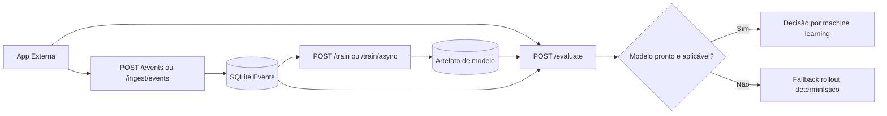

# Visão Geral do Sistema

## Visão geral

O projeto usa arquitetura em camadas (DDD lite):

- `app/api`: entrada HTTP, validação de entrada/saída.
- `app/domain`: entidades, contratos de repositório e regras de negócio.
- `app/infrastructure`: persistência SQLite, machine learning, observabilidade e integrações.

Objetivo principal: manter decisão de feature flag previsível e resiliente, com machine learning opcional e fallback determinístico.

## Componentes principais

- API FastAPI (`app/main.py`, `app/api/v1/routes`).
- Serviços de domínio (`app/domain/services`).
- Repositórios SQLite (`app/infrastructure/repositories`).
- Pipeline de machine learning (`app/infrastructure/ml`).
- Ingestão e simulação de dados (`app/api/v1/routes/ingest.py`, `app/api/v1/routes/simulation.py`).

## Fluxo de alto nível

1. Eventos chegam por `POST /events` ou `POST /ingest/events`.
2. Dados são persistidos e usados para treino via `POST /train` ou `POST /train/async`.
3. `POST /evaluate` decide `enabled=true/false` por usuário.
4. Se machine learning não estiver pronto/válido, aplica rollout determinístico.

## Princípios de design

- Fallback seguro como comportamento padrão.
- Separação entre decisão online (`/evaluate`) e recomendação/análise.
- Evolução incremental com baixo acoplamento entre API, domínio e infraestrutura.

## Leitura complementar

- Fluxo detalhado de decisão: `evaluation-decision-flow.md`
- Mapeamento de código crítico: `../implementation/critical-code-paths.md`
- ADRs do projeto: `../decisions/README.md`
