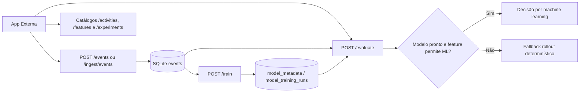

# Visão Geral do Sistema

## Visão geral

O projeto usa arquitetura em camadas (DDD lite):

- `app/api`: entrada HTTP, validação de entrada/saída.
- `app/domain`: entidades, contratos de repositório e regras de negócio.
- `app/infrastructure`: persistência SQLite, machine learning, observabilidade e integrações.

Objetivo principal: manter decisão de feature flag previsível e resiliente, com machine learning opcional, fallback determinístico e catálogos legíveis para atividades e experimentos.

## Componentes principais

- API FastAPI (`app/main.py`, `app/api/v1/routes`).
- Catálogo de atividades (`app/api/v1/routes/activities.py`).
- Feature flags e configuração de rollout (`app/api/v1/routes/features.py`).
- Experimentos A/B-lite (`app/api/v1/routes/experiments.py`).
- Serviços de domínio (`app/domain/services`).
- Repositórios SQLite (`app/infrastructure/repositories`).
- Pipeline de machine learning (`app/infrastructure/ml`).
- Ingestão de dados (`app/api/v1/routes/ingest.py`).
- Esquema físico do banco: `database-schema.md`

## Fluxo de alto nível

1. Eventos chegam por `POST /events` ou `POST /ingest/events`.
2. Catálogos de atividades, features e experimentos mantêm a leitura humana e a governança dos dados.
3. Dados persistidos alimentam o treino via `POST /train`.
4. `POST /evaluate` decide `enabled=true/false` por usuário usando ML quando disponível.
5. Se machine learning não estiver pronto/válido, aplica rollout determinístico.

```mermaid
flowchart LR
    A[App Externa] --> B[POST /events ou /ingest/events]
    A --> C[Catálogos /activities, /features e /experiments]
    B --> D[(SQLite events)]
    D --> E[POST /train]
    E --> F[(model_metadata / model_training_runs)]
    A --> G[POST /evaluate]
    D --> G
    F --> G
    G --> H{Modelo pronto e feature permite ML?}
    H -- Sim --> I[Decisão por machine learning]
    H -- Não --> J[Fallback rollout determinístico]
```

## Princípios de design

- Fallback seguro como comportamento padrão.
- Separação entre decisão online (`/evaluate`) e recomendação/análise.
- Evolução incremental com baixo acoplamento entre API, domínio e infraestrutura.

## Leitura complementar

- Fluxo detalhado de decisão: `evaluation-decision-flow.md`
- Mapeamento de código crítico: `../implementation/critical-code-paths.md`
- ADRs do projeto: `../decisions/README.md`
