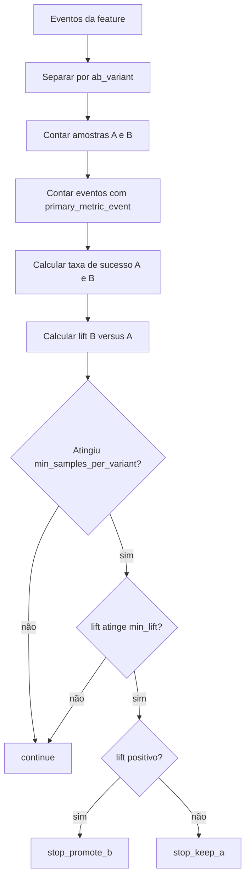

# Fluxo Técnico de Experimentação e A/B

Este documento descreve como o MVP implementa experimentos A/B hoje: criação, atribuição de variante, gravação de eventos e avaliação do resultado.

## 1) Visão geral

O fluxo tem três partes:

- criação do experimento;
- atribuição da variante e registro do evento;
- avaliação agregada do resultado.

```mermaid
flowchart TD
    A[POST /experiments] --> B[Salvar experimento]
    B --> C[Experimento ativo por feature]
    C --> D[Entrada de evento]
    D --> E{Experimento ativo?}
    E -- não --> F[Salvar evento sem variante]
    E -- sim --> G[Anexar ab_variant]
    G --> H[Salvar evento]
    H --> I[Ver resultado do experimento]
    I --> J[Calcular amostras, sucesso e lift]
    J --> K[decision]
```



## 2) Modelo do experimento

No serviço atual, um experimento é criado com estes campos:

- `name`
- `feature_key`
- `primary_metric_event`
- `min_samples_per_variant`
- `min_lift`
- `enabled`

Em termos de regra de negócio:

- `feature_key` identifica a feature observada;
- `primary_metric_event` define qual evento representa sucesso;
- `min_samples_per_variant` define o volume mínimo para decidir;
- `min_lift` define a diferença mínima observável entre A e B;
- `enabled` controla se o experimento entra no fluxo.

## 3) Atribuição de variante

A variante é estável por usuário e por experimento.

Implementação atual:

```text
raw = f"{experiment_id}:{user_id}"
bucket = sha256(raw) -> primeiros 8 hex -> inteiro -> bucket % 100
```

Regra:

- `bucket < 50` => `A`
- `bucket >= 50` => `B`

Isso gera uma divisão 50/50 sem depender da ordem de chegada dos eventos.

### Contexto retornado

Quando existe experimento ativo para a `feature_key`, `maybe_build_context()` devolve:

```json
{
  "experiment_id": 1,
  "experiment_name": "checkout upsell",
  "variant": "A"
}
```

Esse contexto é usado na ingestão e na avaliação.

## 4) Ingestão com `ab_variant`

Na ingestão, se houver experimento ativo para a feature:

1. o serviço encontra o experimento;
2. calcula a variante do usuário;
3. copia `properties`;
4. adiciona `ab_variant`;
5. salva o evento.

Se não houver experimento ativo, o evento é salvo normalmente.

Ponto importante:

- `ab_variant` é salvo em `properties`;
- a decisão operacional continua sendo feita por rollout ou machine learning;
- o experimento apenas registra a variante para análise posterior.
- eventos antigos só entram na conta se já tiverem `ab_variant`; por isso, o cálculo não reaproveita automaticamente histórico sem marcação de variante.

## 5) Avaliação do experimento



O método `evaluate_experiment(experiment_id)` faz o seguinte:

1. busca o experimento;
2. carrega os eventos da `feature_key` do experimento;
3. separa os eventos por `ab_variant`;
4. conta amostras e sucessos;
5. calcula taxa de sucesso por variante;
6. calcula o lift de B contra A;
7. decide se continua ou encerra.

### Fórmulas

Para cada variante:

```text
taxa_de_sucesso = eventos_de_sucesso / amostras
```

Onde:

- `amostras` é a quantidade de eventos com `ab_variant` igual a `A` ou `B`;
- `eventos_de_sucesso` é a quantidade de eventos cujo `event_type` é igual ao `primary_metric_event`.

Depois:

```text
lift_B_vs_A = taxa_de_sucesso_B - taxa_de_sucesso_A
```

### Regra de decisão

1. Se `A` ou `B` não atingirem `min_samples_per_variant`, a decisão é `continue`.
2. Se `abs(lift_B_vs_A) < min_lift`, a decisão é `continue`.
3. Se `lift_B_vs_A > 0`, a decisão é `stop_promote_b`.
4. Se `lift_B_vs_A < 0`, a decisão é `stop_keep_a`.

### O que cada decisão significa

- `continue`: o experimento ainda não tem volume suficiente ou a diferença entre as variantes ainda é pequena demais para decidir. Na UI, aparece como `Em andamento`.
- `stop_promote_b`: a variante B teve resultado melhor e já atingiu o critério mínimo para encerrar. Na UI, aparece como `Escolher B`.
- `stop_keep_a`: a variante A continua melhor. Na UI, aparece como `Manter A`.

Esses são valores internos do backend. A UI traduz o retorno para rótulos amigáveis, mas continua recebendo o valor técnico em `decision` da API.

### Exemplo numérico

Suponha:

- `min_samples_per_variant = 100`
- `min_lift = 0.02`
- `primary_metric_event = purchase_completed`

Resultados:

- A: `120` amostras, `18` sucessos
- B: `130` amostras, `24` sucessos

Cálculo:

```text
taxa_A = 18 / 120 = 0.15
taxa_B = 24 / 130 = 0.1846
lift_B_vs_A = 0.1846 - 0.15 = 0.0346
```

Como:

- as duas variantes passaram do mínimo de amostras;
- o lift é maior que `0.02`;
- o lift é positivo;

a decisão final é `stop_promote_b`.

## 6) Relação com a avaliação operacional

O experimento não substitui a decisão de `/evaluate`.

- a decisão da feature continua sendo feita por machine learning ou rollout;
- o experimento apenas acompanha a variação entre A e B;
- o resultado do experimento pode orientar a evolução do rollout.

## 7) Limitações atuais

- a divisão é binária, sem A/B/n;
- não há significância estatística formal;
- não há janela temporal na avaliação agregada;
- a decisão ainda depende de contagem simples de sucesso e lift;
- não há painel dedicado de experimentação.

## 8) Próximos passos

1. Adicionar hipótese e métrica-alvo ao modelo do experimento.
2. Introduzir estatística inferencial.
3. Incluir janela temporal e critérios de parada mais robustos.
4. Integrar a decisão do experimento ao fluxo de rollout.
