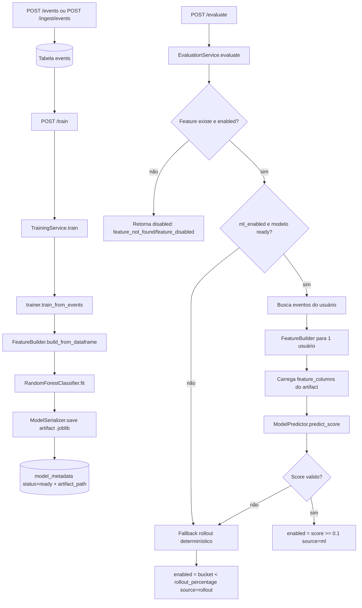

# ML e Decisão Online (Detalhado)

Este documento explica como o código de ML funciona hoje, do treino até a decisão online no endpoint `POST /evaluate`.

## 1) Visão geral do fluxo

1. Eventos são persistidos (`/events` ou `/ingest/events`).
2. `POST /train` chama `TrainingService.train()`.
3. O treino gera artefato `.joblib` com modelo + metadados + colunas.
4. `POST /evaluate` usa `EvaluationService.evaluate()`.
5. Se ML estiver disponível, calcula score; se não, aplica fallback de rollout determinístico.

Arquivos centrais:

- `app/domain/services/training_service.py`
- `app/infrastructure/ml/trainer.py`
- `app/infrastructure/ml/feature_builder.py`
- `app/infrastructure/ml/serializer.py`
- `app/domain/services/evaluation_service.py`
- `app/infrastructure/ml/predictor.py`

## 2) Como o treino funciona

Entrada:

- `TrainingService.train()` lê todos os eventos do repositório.
- Valida que existe ao menos um evento.
- Conta métricas de processo (`total_events`, `unique_users`, `positive_events`).

Transformação para dataset:

- `train_from_events()` monta DataFrame com:
  - `user_id`
  - `event_type`
  - `timestamp`
  - `feature_key`
- `FeatureBuilder.build_from_dataframe()` agrega por usuário e cria features numéricas.

Features usadas no treino (MVP):

- `unique_features`
- `active_days`
- `avg_hour`
- `avg_day_of_week`
- `hours_since_last_event`
- `events_per_day`

Treinamento:

- Modelo: `RandomForestClassifier(class_weight="balanced", random_state=42)`.
- Split: `train_test_split(..., stratify=y)`.
- Regras mínimas:
  - ao menos 2 classes em `y`;
  - ao menos 2 amostras por classe.

Saída:

- Artefato salvo por `ModelSerializer.save()` em `MODELS_DIR` (`v1.joblib`).
- Metadados persistidos com status `ready`.

## 3) Como a decisão no `/evaluate` funciona

`EvaluationService.evaluate(feature_key, user)` segue esta ordem:

1. Feature não existe:
  - retorna `enabled=false`, `decision_source="feature_not_found"`.
2. Feature desabilitada:
  - retorna `enabled=false`, `decision_source="feature_disabled"`.
3. Se `ml_enabled=true` e modelo `ready` com `artifact_path`:
  - tenta score de ML.
4. Se score válido:
  - `enabled = score >= 0.1`
  - `decision_source="ml"`.
5. Se qualquer etapa de ML falhar:
  - fallback para rollout determinístico (`decision_source="rollout"`).

### 3.1 Cálculo de score

`_predict_score()`:

1. Busca eventos do usuário.
2. Constrói DataFrame desse usuário.
3. Usa `FeatureBuilder` para gerar uma linha agregada.
4. Lê `feature_columns` do artefato com `ModelSerializer.load_feature_columns()`.
5. Valida colunas esperadas.
6. `ModelPredictor.predict_score(payload)` retorna probabilidade da classe positiva.
7. Score final é limitado para `[0.0, 1.0]`.

Qualquer erro nessa cadeia retorna `None` e ativa fallback.

### 3.2 Fallback determinístico

Quando não há decisão por ML:

- Calcula bucket estável com `sha256(f"{user_id}:{feature_key}") % 100`.
- Habilita se `bucket < rollout_percentage`.

Isso garante consistência por usuário/feature entre chamadas.

## 4) Como `FeatureBuilder` define sinal positivo

`FeatureBuilder` usa conjuntos vindos de `app/core/event_types.py`:

- `POSITIVE_EVENT_TYPES`
- `VIEW_EVENT_TYPES`
- `INTERMEDIATE_POSITIVE_EVENT_TYPES`
- `TERMINAL_POSITIVE_EVENT_TYPES`

Esses conjuntos são derivados de `settings` e controlam:

- `positive_events`
- `view_events`
- `cart_events`
- `purchase_events`
- `target` (1 se usuário teve evento positivo; senão 0)

## 5) Observabilidade no fluxo de ML

No treino:

- `training.duration_ms`
- `model.accuracy`
- `model.f1_score`

Na avaliação:

- `evaluation.count`
- `evaluation.decision_source` (com tag `source`)
- `evaluation.enabled.count`

Implementação atual em memória/log:

- `app/infrastructure/observability/metrics.py`
