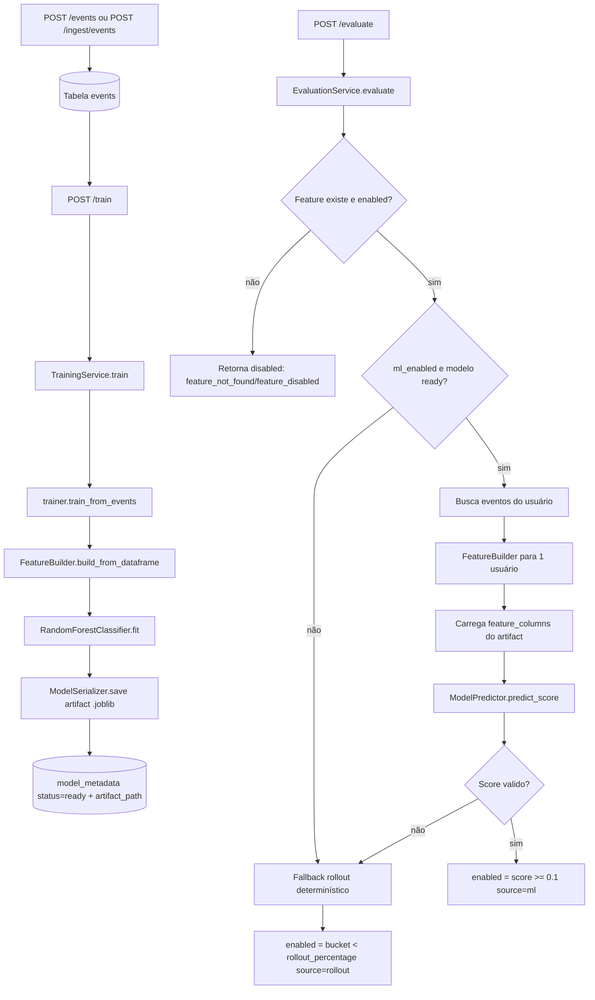

# ML e Decisão Online (Detalhado)

Este documento explica como o código de ML funciona hoje, do treino até a decisão online no endpoint `POST /evaluate`.

## 1) Visão geral do fluxo

1. Eventos são persistidos (`/events` ou `/ingest/events`).
2. `POST /train` chama `TrainingService.train()`.
3. O treino transforma eventos brutos em features agregadas por usuário e gera artefato `.joblib` com modelo + metadados + colunas.
4. `POST /evaluate` usa `EvaluationService.evaluate()`.
5. Se o modelo estiver pronto e a feature permitir ML, calcula score; se não, aplica fallback de rollout determinístico.

O ponto principal é que o modelo não lê nomes de eventos isolados. Ele lê sinais agregados por usuário, construídos a partir da taxonomia de eventos do produto:

- `VIEW_EVENT_TYPES`: exposição.
- `INTERMEDIATE_POSITIVE_EVENT_TYPES`: interesse no meio do funil.
- `TERMINAL_POSITIVE_EVENT_TYPES`: conversão final.
- `POSITIVE_EVENT_TYPES`: conjunto positivo total usado no target do treino.

Arquivos centrais:

- `app/domain/services/training_service.py`
- `app/infrastructure/ml/trainer.py`
- `app/infrastructure/ml/feature_builder.py`
- `app/infrastructure/ml/serializer.py`
- `app/domain/services/evaluation_service.py`
- `app/infrastructure/ml/predictor.py`

```mermaid
flowchart TD
    A[POST /events ou POST /ingest/events] --> B[(Tabela events)]
    B --> C[POST /train]
    C --> D[TrainingService.train]
    D --> E[trainer.train_from_events]
    E --> F[FeatureBuilder.build_from_dataframe]
    F --> G[RandomForestClassifier.fit]
    G --> H[ModelSerializer.save artifact .joblib]
    H --> I[(model_metadata status=ready + artifact_path)]

    J[POST /evaluate] --> K[EvaluationService.evaluate]
    K --> L{Feature existe e enabled?}
    L -- não --> M[Retorna disabled: feature_not_found/feature_disabled]
    L -- sim --> N{ml_enabled e modelo ready?}
    N -- não --> O[Fallback rollout determinístico]
    N -- sim --> P[Busca eventos do usuário]
    P --> Q[FeatureBuilder para 1 usuário]
    Q --> R[Carrega feature_columns do artifact]
    R --> S[ModelPredictor.predict_score]
    S --> T{Score valido?}
    T -- não --> O
    T -- sim --> U[enabled = score >= 0.1 source=ml]
    O --> V[enabled = bucket < rollout_percentage source=rollout]
```

## 2) Como o treino funciona

Entrada:

- `TrainingService.train()` lê todos os eventos do repositório.
- Valida que existe ao menos um evento.
- Conta métricas de processo (`total_events`, `unique_users`, `positive_events`).

Transformação para dataset:

- `train_from_events()` monta DataFrame com:
  - `user_id`
  - `event_type`
  - `timestamp`
  - `feature_key`
- `FeatureBuilder.build_from_dataframe()` agrega por usuário e cria features numéricas.

Features usadas no treino (MVP):

Essas colunas são calculadas por usuário a partir dos eventos brutos:

- `unique_features`: quantidade de `feature_key` distintos acessados pelo usuário.
- `active_days`: quantidade de dias diferentes com evento.
- `avg_hour`: média da hora dos eventos do usuário.
- `avg_day_of_week`: média do dia da semana dos eventos.
- `hours_since_last_event`: horas desde o último evento até o timestamp de referência do treino.
- `events_per_day`: total de eventos dividido pelos dias ativos do usuário.

Treinamento:

- Modelos candidatos:
  - `RandomForestClassifier(class_weight="balanced", random_state=42)`
  - `LogisticRegression(class_weight="balanced", random_state=42, max_iter=1000)`
  - `GradientBoostingClassifier(random_state=42)`
- Seleção: o treino escolhe automaticamente o candidato com maior `f1_score` no conjunto de teste.
- Split: `train_test_split(..., stratify=y)`.
- Regras mínimas:
  - ao menos 2 classes em `y`;
  - ao menos 2 amostras por classe.

Saída:

- Artefato salvo por `ModelSerializer.save()` em `MODELS_DIR` (`v1.joblib`).
- Metadados persistidos com status `ready`.

## 3) Como a decisão no `/evaluate` funciona

`EvaluationService.evaluate(feature_key, user)` segue esta ordem:

1. Feature não existe:
  - retorna `enabled=false`, `decision_source="feature_not_found"`.
2. Feature desabilitada:
  - retorna `enabled=false`, `decision_source="feature_disabled"`.
3. Se `ml_enabled=true` e modelo `ready` com `artifact_path`:
  - tenta score de ML.
4. Se score válido:
  - `enabled = score >= 0.1`
  - `decision_source="ml"`.
5. Se qualquer etapa de ML falhar:
  - fallback para rollout determinístico (`decision_source="rollout"`).

### 3.1 Cálculo de score

`_predict_score()`:

1. Busca eventos do usuário.
2. Constrói DataFrame desse usuário.
3. Usa `FeatureBuilder` para gerar uma linha agregada.
4. Lê `feature_columns` do artefato com `ModelSerializer.load_feature_columns()`.
5. Valida colunas esperadas.
6. `ModelPredictor.predict_score(payload)` retorna probabilidade da classe positiva.
7. Score final é limitado para `[0.0, 1.0]`.

Qualquer erro nessa cadeia retorna `None` e ativa fallback.

### 3.2 Fallback determinístico

Quando não há decisão por ML:

- Calcula bucket estável com `sha256(f"{user_id}:{feature_key}") % 100`.
- Habilita se `bucket < rollout_percentage`.

Isso garante consistência por usuário/feature entre chamadas.

### 3.3 Como o threshold da decisão é escolhido

A feature controla a política de threshold com `ml_threshold_mode`:

- `fixed`: usa `ml_threshold_value` salvo na própria feature.
- `match_rollout`: deriva o threshold do `rollout_percentage`, para manter a experiência alinhada ao rollout atual.
- `maximize_f1`: usa o `best_threshold_by_f1` calculado no treino e salvo no metadata do modelo.

Na prática:

- a feature define a política;
- o treino calcula métricas e o melhor threshold do modelo;
- a avaliação escolhe o caminho mais adequado na hora da decisão.

O treino não sobrescreve a feature com esse threshold. Ele salva o resultado do modelo e o metadata correspondente.

## 4) Taxonomia de eventos

Os conjuntos vêm de `app/core/event_types.py`, que normaliza os valores definidos em `settings`:

- `POSITIVE_EVENT_TYPES`
- `VIEW_EVENT_TYPES`
- `INTERMEDIATE_POSITIVE_EVENT_TYPES`
- `TERMINAL_POSITIVE_EVENT_TYPES`

### 4.1 O que cada grupo significa

| Grupo | Papel no produto | Exemplos | Uso na ML |
| --- | --- | --- | --- |
| `VIEW_EVENT_TYPES` | exposição / awareness | `view`, `checkout_upsell_shown`, `onboarding_step_shown` | vira `is_view` e alimenta `view_events` |
| `INTERMEDIATE_POSITIVE_EVENT_TYPES` | interesse no meio do funil | `checkout_upsell_clicked`, `pricing_details_opened`, `hero_cta_clicked` | vira `is_intermediate_positive` e alimenta `cart_events` |
| `TERMINAL_POSITIVE_EVENT_TYPES` | conversão final | `transaction`, `purchase_completed`, `subscription_upgraded` | vira `is_terminal_positive` e alimenta `purchase_events` |
| `POSITIVE_EVENT_TYPES` | qualquer evento de sucesso relevante | união dos sinais acima + eventos como `addtocart` | vira `is_positive`, `positive_events` e o `target` |

### 4.2 Como isso vira features

`FeatureBuilder` marca cada evento com flags booleanas e depois agrega por usuário.
As colunas principais geradas pelo builder são:

- `positive_events`
- `view_events`
- `cart_events`
- `purchase_events`
- `unique_features`
- `active_days`
- `hours_since_last_event`
- `events_per_day`
- `positive_rate`
- `target`

O target do MVP é binário:

- `1` se o usuário tiver pelo menos um evento em `POSITIVE_EVENT_TYPES`
- `0` caso contrário

Isso permite treinar um modelo que aprenda padrões de engajamento e conversão a partir da telemetria realista do seed ou da ingestão.

## 5) Observabilidade no fluxo de ML

No treino:

- `training.duration_ms`
- `model.accuracy`
- `model.f1_score`

Na avaliação:

- `evaluation.count`
- `evaluation.decision_source` (com tag `source`)
- `evaluation.enabled.count`

Implementação atual em memória/log:

- `app/infrastructure/observability/metrics.py`
