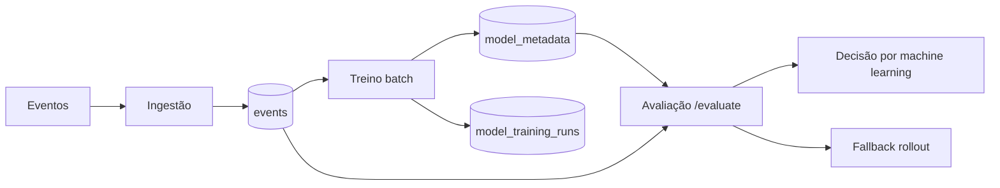

# Machine Learning e Avaliação em Tempo de Requisição

Visão geral consolidada do fluxo de machine learning do projeto.

Este arquivo resume o caminho completo:

- eventos entram pela ingestão;
- os eventos alimentam o treino batch;
- o treino gera o artefato do modelo;
- a avaliação em `/evaluate` usa esse artefato quando ele está disponível;
- se a pontuação não estiver disponível, a decisão cai para rollout determinístico;
- a taxonomia de eventos sustenta tanto o target do treino quanto a leitura da atividade recente na avaliação.

```mermaid
flowchart LR
    A[Eventos] --> B[Ingestão]
    B --> C[(events)]
    C --> D[Treino batch]
    D --> E[(model_metadata)]
    D --> F[(model_training_runs)]
    E --> G[Avaliação /evaluate]
    C --> G
G --> H[Decisão por machine learning]
    G --> I[Fallback rollout]
```

Para os detalhes específicos, use os documentos separados:

- [`ml-events-and-ingest.md`](ml-events-and-ingest.md): ingestão, validação e persistência
- [`ml-train-and-feature-builder.md`](ml-train-and-feature-builder.md): treino, features e taxonomia de eventos
- [`ml-evaluation-decision-flow.md`](ml-evaluation-decision-flow.md): decisão em tempo de requisição, threshold e fallback

## O que este fluxo cobre

- eventos canônicos persistidos em `events`;
- treino batch com comparação de candidatos;
- decisão online com `score`, `threshold` e `threshold_mode`;
- fallback para rollout quando machine learning não pode decidir;
- leitura da atividade mais recente do usuário na avaliação;
- observabilidade básica do treino e da avaliação.

## Arquivos centrais

- `app/domain/services/training_service.py`
- `app/infrastructure/ml/trainer.py`
- `app/infrastructure/ml/feature_builder.py`
- `app/infrastructure/ml/serializer.py`
- `app/domain/services/evaluation_service.py`
- `app/infrastructure/ml/predictor.py`
- `app/domain/services/ingest_service.py`
- `app/domain/services/event_service.py`

## Relação entre as partes

1. A ingestão recebe eventos e grava no banco.
2. O treino lê esses eventos e constrói o dataset de machine learning.
3. A avaliação consulta a feature, busca o contexto do usuário e decide.
4. Se machine learning não estiver disponível, a feature usa rollout.

## Observação

Este arquivo não repete os detalhes de implementação. Ele serve como ponto de entrada para a navegação do fluxo de machine learning e avaliação.
