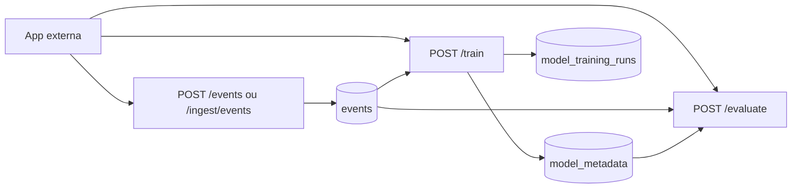
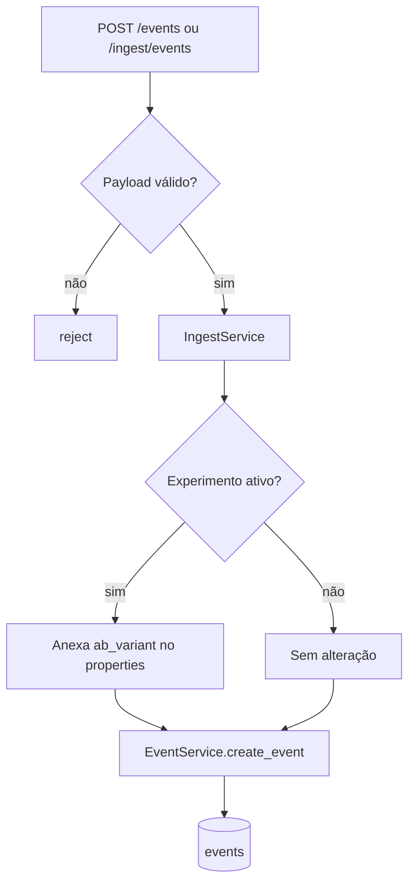
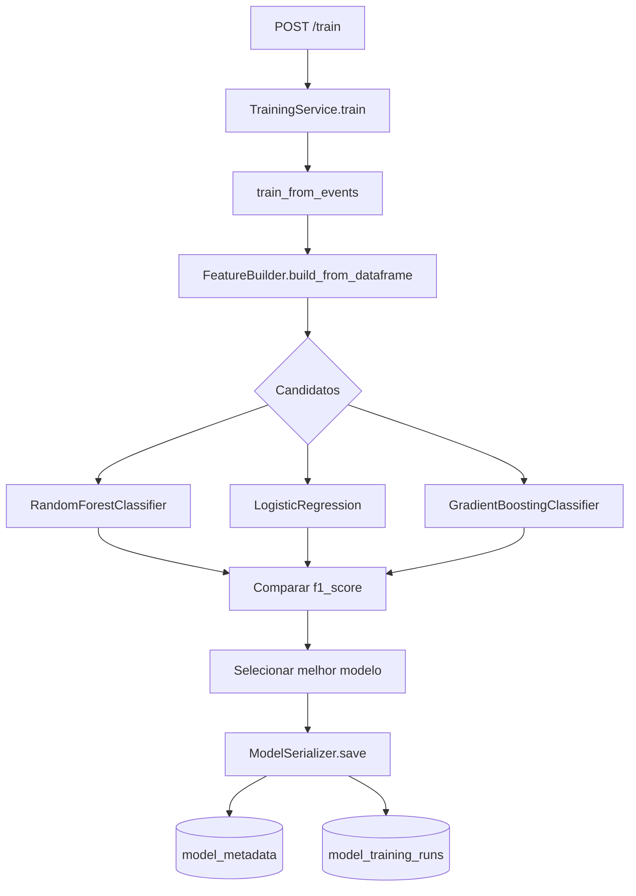
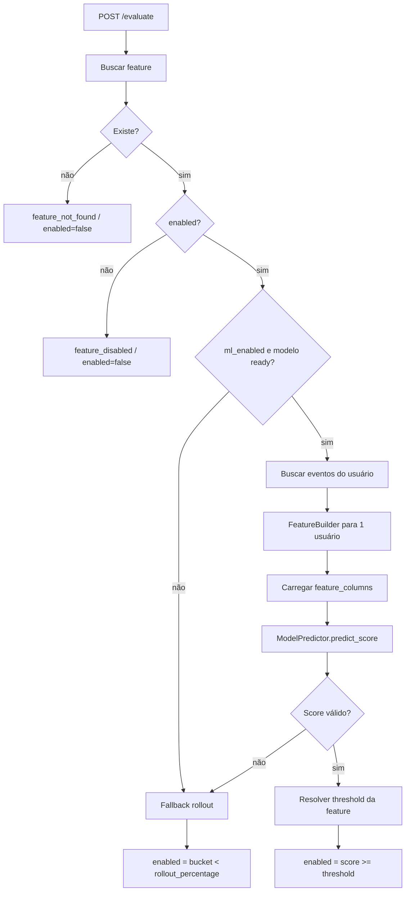

# Machine Learning e Avaliação em Tempo de Requisição

Este documento explica como o fluxo de machine learning funciona hoje, separando ingestão, treino e avaliação em tempo de requisição.

## 1) Visão geral

O fluxo do sistema tem três partes distintas:

- ingestão e persistência de eventos;
- treino batch do modelo;
- avaliação em tempo de requisição por usuário.

```mermaid
flowchart LR
    A[App externa] --> B[POST /events ou /ingest/events]
    B --> C[(events)]
    A --> D[POST /train]
    C --> D
    D --> E[(model_metadata)]
    D --> F[(model_training_runs)]
    A --> G[POST /evaluate]
    C --> G
    E --> G
```

O ponto principal é que o modelo não lê eventos isolados. Ele usa sinais agregados por usuário, construídos a partir da taxonomia de atividades do produto e da camada de machine learning:

- `VIEW_EVENT_TYPES`: exposição.
- `INTERMEDIATE_POSITIVE_EVENT_TYPES`: interesse no meio do funil.
- `TERMINAL_POSITIVE_EVENT_TYPES`: conversão final.
- `POSITIVE_EVENT_TYPES`: conjunto positivo total usado no target do treino.

Arquivos centrais:

- `app/domain/services/training_service.py`
- `app/infrastructure/ml/trainer.py`
- `app/infrastructure/ml/feature_builder.py`
- `app/infrastructure/ml/serializer.py`
- `app/domain/services/evaluation_service.py`
- `app/infrastructure/ml/predictor.py`

## 2) Ingestão e persistência

A ingestão canônica aceita um lote de eventos e grava no banco antes de qualquer treino.

```mermaid
flowchart TD
    A[POST /events ou /ingest/events] --> B{Payload válido?}
    B -- não --> C[reject]
    B -- sim --> D[IngestService]
    D --> E{Experimento ativo?}
    E -- sim --> F[Anexa ab_variant no properties]
    E -- não --> G[Sem alteração]
    F --> H[EventService.create_event]
    G --> H
    H --> I[(events)]
```

Regras importantes da ingestão:

- `source` não pode estar vazio;
- o lote precisa ter ao menos um evento;
- `timestamp` precisa estar em UTC e não pode ser futuro;
- `properties` precisa ser um objeto;
- `latency_ms`, quando presente, precisa ficar entre `0` e `120000`.

Na persistência de eventos:

- a identidade lógica usa `user_id`, `feature_key`, `event_type` e `source`;
- se o mesmo evento lógico chegar de novo, o repositório atualiza o registro existente;
- `updated_at` registra a última mutação e ajuda na ordenação.

## 3) Treino do modelo

O treino é batch. Ele lê os eventos persistidos, agrega por usuário e compara candidatos de modelo.

```mermaid
flowchart TD
    A[POST /train] --> B[TrainingService.train]
    B --> C[train_from_events]
    C --> D[FeatureBuilder.build_from_dataframe]
    D --> E{Candidatos}
    E --> F[RandomForestClassifier]
    E --> G[LogisticRegression]
    E --> H[GradientBoostingClassifier]
    F --> I[Comparar f1_score]
    G --> I
    H --> I
    I --> J[Selecionar melhor modelo]
    J --> K[ModelSerializer.save]
    K --> L[(model_metadata)]
    K --> M[(model_training_runs)]
```

O treino funciona assim:

1. `TrainingService.train()` lê todos os eventos do repositório.
2. `train_from_events()` monta um DataFrame com `user_id`, `event_type`, `timestamp` e `feature_key`.
3. `FeatureBuilder.build_from_dataframe()` agrega por usuário e cria as features numéricas.
4. O treino compara três candidatos:
   - `RandomForestClassifier`
   - `LogisticRegression`
   - `GradientBoostingClassifier`
5. O vencedor é o que tem maior `f1_score` no conjunto de teste.
6. O artefato `.joblib` e os metadados são persistidos.

Features usadas no MVP:

- `unique_features`
- `active_days`
- `avg_hour`
- `avg_day_of_week`
- `hours_since_last_event`
- `events_per_day`

Regras mínimas:

- precisa haver pelo menos 2 classes em `y`;
- precisa haver pelo menos 2 amostras por classe.

## 4) Avaliação em tempo de requisição em `/evaluate`

`EvaluationService.evaluate(feature_key, user)` segue esta ordem:

1. Busca a feature.
2. Se não existir: `decision_source="feature_not_found"`.
3. Se existir mas estiver desabilitada: `decision_source="feature_disabled"`.
4. Se `ml_enabled=true` e o modelo estiver `ready` com `artifact_path`, tenta inferência.
5. Se a inferência funcionar, resolve o threshold da feature e decide por machine learning.
6. Se qualquer etapa falhar, faz fallback determinístico por rollout.

```mermaid
flowchart TD
    A[POST /evaluate] --> B[Buscar feature]
    B --> C{Existe?}
    C -- não --> D[feature_not_found / enabled=false]
    C -- sim --> E{enabled?}
    E -- não --> F[feature_disabled / enabled=false]
    E -- sim --> G{ml_enabled e modelo ready?}
    G -- não --> H[Fallback rollout]
    G -- sim --> I[Buscar eventos do usuário]
    I --> J[FeatureBuilder para 1 usuário]
    J --> K[Carregar feature_columns]
    K --> L[ModelPredictor.predict_score]
    L --> M{Score válido?}
    M -- não --> H
    M -- sim --> N[Resolver threshold da feature]
    N --> O[enabled = score >= threshold]
    H --> P[enabled = bucket < rollout_percentage]
```

Como a atividade é resolvida:

- a avaliação busca o evento mais recente do mesmo `user_id` e `feature_key`;
- o campo `activity` da resposta recebe o `event_type` desse evento;
- se não houver evento compatível, `activity` fica `null`.

Como o fallback determinístico funciona:

- calcula `sha256(f"{user_id}:{feature_key}")`;
- converte para bucket `0..99`;
- habilita quando `bucket < rollout_percentage`.

Como o threshold é escolhido:

- `fixed`: usa `ml_threshold_value`;
- `match_rollout`: aproxima o corte para acompanhar a cobertura do rollout;
- `maximize_f1`: usa o melhor threshold encontrado no treino.

Na interface:

- `Pontuação mínima` é o threshold configurado na regra quando o modo está em `Corte fixo`;
- `Percentual de liberação` define a cobertura alvo quando o modo está em `Acompanhar cobertura`;
- `Automática` usa o melhor corte encontrado no treino.

## 5) Taxonomia de eventos

Os conjuntos vêm de `app/core/event_types.py`, que normaliza os valores definidos em `settings`:

- `POSITIVE_EVENT_TYPES`
- `VIEW_EVENT_TYPES`
- `INTERMEDIATE_POSITIVE_EVENT_TYPES`
- `TERMINAL_POSITIVE_EVENT_TYPES`

### 5.1 O que cada grupo significa

| Grupo | Papel no produto | Exemplos | Uso na ML |
| --- | --- | --- | --- |
| `VIEW_EVENT_TYPES` | exposição / awareness | `view`, `checkout_upsell_shown`, `onboarding_step_shown` | vira `is_view` e alimenta `view_events` |
| `INTERMEDIATE_POSITIVE_EVENT_TYPES` | interesse no meio do funil | `checkout_upsell_clicked`, `pricing_details_opened`, `hero_cta_clicked` | vira `is_intermediate_positive` e alimenta `cart_events` |
| `TERMINAL_POSITIVE_EVENT_TYPES` | conversão final | `transaction`, `purchase_completed`, `subscription_upgraded` | vira `is_terminal_positive` e alimenta `purchase_events` |
| `POSITIVE_EVENT_TYPES` | qualquer evento de sucesso relevante | união dos sinais acima + eventos como `addtocart` | vira `is_positive`, `positive_events` e o `target` |

### 5.2 Como isso vira features

`FeatureBuilder` marca cada evento com flags booleanas e depois agrega por usuário.
As colunas principais geradas pelo builder são:

- `positive_events`
- `view_events`
- `cart_events`
- `purchase_events`
- `unique_features`
- `active_days`
- `hours_since_last_event`
- `events_per_day`
- `positive_rate`
- `target`

O target do MVP é binário:

- `1` se o usuário tiver pelo menos um evento em `POSITIVE_EVENT_TYPES`
- `0` caso contrário

Isso permite treinar um modelo que aprenda padrões de engajamento e conversão a partir da telemetria realista do seed ou da ingestão.

## 6) Observabilidade no fluxo de machine learning

No treino:

- `training.duration_ms`
- `model.accuracy`
- `model.f1_score`

Na avaliação:

- `evaluation.count`
- `evaluation.decision_source` (com tag `source`)
- `evaluation.enabled.count`

Implementação atual em memória/log:

- `app/infrastructure/observability/metrics.py`
