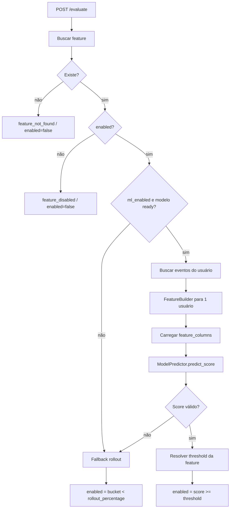

# Machine Learning: Avaliação em Tempo de Requisição

Este documento detalha a decisão em `/evaluate`, o fallback determinístico, o uso de `activity` e a escolha do threshold.

## 1) Avaliação em tempo de requisição em `/evaluate`

`EvaluationService.evaluate(feature_key, user)` segue esta ordem:

1. Busca a feature.
2. Se não existir: `decision_source="feature_not_found"`.
3. Se existir mas estiver desabilitada: `decision_source="feature_disabled"`.
4. Se `ml_enabled=true` e o modelo estiver `ready` com `artifact_path`, tenta inferência.
5. Se a inferência funcionar, resolve o threshold da feature e decide por machine learning.
6. Se qualquer etapa falhar, faz fallback determinístico por rollout.

Como a atividade é resolvida:

- a avaliação busca o evento mais recente do mesmo `user_id` e `feature_key`;
- o campo `activity` da resposta recebe o `event_type` desse evento;
- se não houver evento compatível, `activity` fica `null`.

Como o fallback determinístico funciona:

- calcula `sha256(f"{user_id}:{feature_key}")`;
- converte para bucket `0..99`;
- habilita quando `bucket < rollout_percentage`.

Como o threshold é escolhido:

- `fixed`: usa `ml_threshold_value`;
- `match_rollout`: aproxima o corte para acompanhar a cobertura do rollout;
- `maximize_f1`: usa o melhor threshold encontrado no treino.

### Campos devolvidos

- `feature_key`: feature avaliada;
- `user_id`: usuário avaliado;
- `activity`: atividade mais recente daquele usuário para a feature;
- `enabled`: decisão booleana final;
- `decision_source`: origem da decisão;
- `score`: pontuação do modelo quando machine learning é usado;
- `threshold`: corte aplicado na feature;
- `threshold_mode`: política de threshold usada;
- `experiment`: contexto experimental quando existir;
- `model_version`: versão do artefato usado na inferência.

### `decision_source`

- `feature_not_found`: a feature não existe;
- `feature_disabled`: a feature existe, mas está desabilitada;
- `ml`: a pontuação do modelo foi usada;
- `rollout`: o fallback determinístico foi usado.

Na interface:

- `Pontuação mínima` é o threshold configurado na regra quando o modo está em `Corte fixo`;
- `Percentual de liberação` define a cobertura alvo quando o modo está em `Acompanhar cobertura`;
- `Automática` usa o melhor corte encontrado no treino.

### Quando `activity` fica nulo

- não existe evento para o par `user_id` + `feature_key`;
- o histórico está vazio para aquele usuário;
- a leitura do evento mais recente não retorna um `event_type` válido.

## 2) Observabilidade no fluxo de machine learning

Na avaliação:

- `evaluation.count`
- `evaluation.decision_source` (com tag `source`)
- `evaluation.enabled.count`

Esses contadores ajudam a enxergar:

- quantas avaliações aconteceram;
- quantas caíram em ML versus rollout;
- quantas liberaram a feature.

Implementação atual em memória/log:

- `app/infrastructure/observability/metrics.py`
