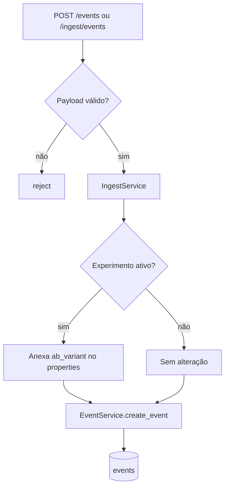

# Machine Learning: Ingestão e Persistência de Eventos

Este documento detalha a ingestão canônica, a validação de eventos e a persistência usada pelo treino e pela avaliação.

## 1) Ingestão e persistência

A ingestão canônica aceita um lote de eventos e grava no banco antes de qualquer treino.
O contrato atual limita cada requisição a `1000` eventos.
A ingestão também aplica limite de taxa por cliente/IP para reduzir abuso por várias requisições pequenas.

Regras importantes da ingestão:

- `source` não pode estar vazio;
- o lote precisa ter ao menos um evento e no máximo `1000` itens;
- o serviço bloqueia excesso de eventos por cliente/IP em janela deslizante;
- `timestamp` precisa estar em UTC e não pode ser futuro;
- `properties` precisa ser um objeto;
- `latency_ms`, quando presente, precisa ficar entre `0` e `120000`.

### O que cada campo faz

- `source`: identifica a aplicação de origem e vira parte da identidade lógica do evento.
- `user_id`: identifica o usuário observado.
- `feature_key`: identifica a feature associada ao evento.
- `event_type`: identifica tecnicamente a atividade registrada.
- `timestamp`: permite ordenação, validação e reconstrução de histórico.
- `properties`: carrega metadados livres e sinais operacionais opcionais.

### Validação aplicada pelo serviço

- `user_id`, `feature_key` e `event_type` não aceitam vazio.
- `properties` precisa ser `dict`.
- `timestamp` precisa ser `datetime` com timezone.
- `timestamp` no futuro é rejeitado.
- `latency_ms` é o único métrico operacional validado hoje.

Na persistência de eventos:

- a identidade lógica usa `user_id`, `feature_key`, `event_type` e `source`;
- se o mesmo evento lógico chegar de novo, o repositório atualiza o registro existente;
- `updated_at` registra a última mutação e ajuda na ordenação.

### Experimento ativo

Quando o sistema encontra um experimento ativo para a `feature_key`:

1. a variante do usuário é calculada de forma determinística;
2. `ab_variant` é anexado em `properties`;
3. o evento persistido passa a carregar contexto para a análise posterior.

Se não houver experimento ativo:

- o evento é gravado sem `ab_variant`;
- o contrato base de ingestão continua simples e independente da camada experimental.

### Lote

No modo lote:

- cada item válido é persistido separadamente;
- os itens inválidos são rejeitados individualmente;
- a API retorna a contagem de `saved_events` e `rejected`;
- o processamento não para no primeiro erro.

## 2) Relação com o treino

O treino batch lê os eventos persistidos e agrega os sinais por usuário antes de comparar os candidatos de modelo.

Isso significa que:

- a ingestão é a porta de entrada do dataset;
- o treino não usa eventos voláteis em memória;
- a persistência é a fonte de verdade para o pipeline de machine learning.
