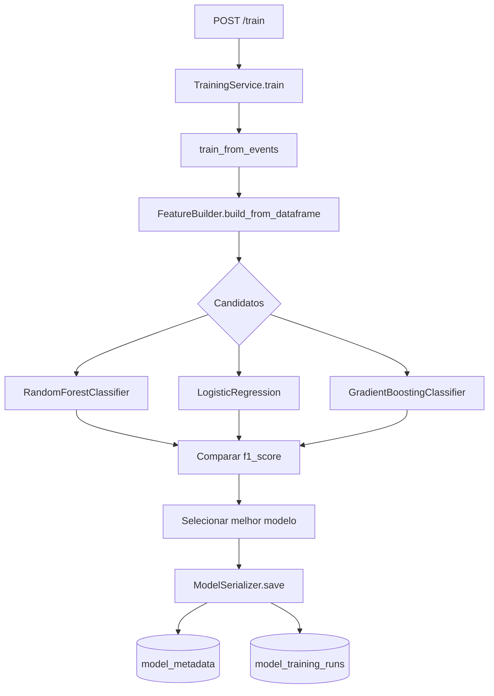

# Machine Learning: Treino e Feature Builder

Este documento detalha o treino batch do modelo, a montagem de features e a persistência do artefato.

## 1) Treino do modelo

O treino é batch. Ele lê os eventos persistidos, agrega por usuário e compara candidatos de modelo.

O treino funciona assim:

1. `TrainingService.train()` lê todos os eventos do repositório.
2. `train_from_events()` monta um DataFrame com `user_id`, `event_type`, `timestamp` e `feature_key`.
3. `FeatureBuilder.build_from_dataframe()` agrega por usuário e cria as features numéricas.
4. O treino compara três candidatos:
   - `RandomForestClassifier`
   - `LogisticRegression`
   - `GradientBoostingClassifier`
5. O vencedor é o que tem maior `f1_score` no conjunto de teste.
6. O artefato `.joblib` e os metadados são persistidos.

Features usadas no MVP:

- `unique_features`
- `active_days`
- `avg_hour`
- `avg_day_of_week`
- `hours_since_last_event`
- `events_per_day`

Regras mínimas:

- precisa haver pelo menos 2 classes em `y`;
- precisa haver pelo menos 2 amostras por classe.

### O que entra e o que sai

Entradas:

- eventos persistidos em `events`;
- colunas básicas: `user_id`, `event_type`, `timestamp`, `feature_key`.

Saídas:

- artefato `.joblib`;
- metadados em `model_metadata`;
- histórico da execução em `model_training_runs`.

### Como o modelo é selecionado

O sistema compara os candidatos pelo `f1_score` no conjunto de teste.
O melhor modelo é o que maximiza esse critério dentro da execução atual.

Quando o treino termina:

- o serializer grava o artefato;
- o status do modelo passa para `ready`;
- `model_version` e `artifact_path` ficam disponíveis para `/evaluate`.

## 2) Taxonomia de eventos

Os conjuntos vêm de `app/core/event_types.py`, que normaliza os valores definidos em `settings`:

- `POSITIVE_EVENT_TYPES`
- `VIEW_EVENT_TYPES`
- `INTERMEDIATE_POSITIVE_EVENT_TYPES`
- `TERMINAL_POSITIVE_EVENT_TYPES`

### 2.1 O que cada grupo significa

| Grupo | Papel no produto | Exemplos | Uso em machine learning |
| --- | --- | --- | --- |
| `VIEW_EVENT_TYPES` | exposição / awareness | `view`, `checkout_upsell_shown`, `onboarding_step_shown` | vira `is_view` e alimenta `view_events` |
| `INTERMEDIATE_POSITIVE_EVENT_TYPES` | interesse no meio do funil | `checkout_upsell_clicked`, `pricing_details_opened`, `hero_cta_clicked` | vira `is_intermediate_positive` e alimenta `cart_events` |
| `TERMINAL_POSITIVE_EVENT_TYPES` | conversão final | `transaction`, `purchase_completed`, `subscription_upgraded` | vira `is_terminal_positive` e alimenta `purchase_events` |
| `POSITIVE_EVENT_TYPES` | qualquer evento de sucesso relevante | união dos sinais acima + eventos como `addtocart` | vira `is_positive`, `positive_events` e o `target` |

### 2.2 Como isso vira features

`FeatureBuilder` marca cada evento com flags booleanas e depois agrega por usuário.
As colunas principais geradas pelo builder são:

- `positive_events`
- `view_events`
- `cart_events`
- `purchase_events`
- `unique_features`
- `active_days`
- `hours_since_last_event`
- `events_per_day`
- `positive_rate`
- `target`

O target do MVP é binário:

- `1` se o usuário tiver pelo menos um evento em `POSITIVE_EVENT_TYPES`
- `0` caso contrário

Isso permite treinar um modelo que aprenda padrões de engajamento e conversão a partir da telemetria realista do seed ou da ingestão.

### Leitura prática da taxonomia

- `VIEW_EVENT_TYPES` ajuda a capturar exposição.
- `INTERMEDIATE_POSITIVE_EVENT_TYPES` ajuda a capturar intenção.
- `TERMINAL_POSITIVE_EVENT_TYPES` ajuda a capturar conversão.
- `POSITIVE_EVENT_TYPES` reúne os sinais que o MVP considera úteis para o alvo do treino.

Essa organização evita que o treino dependa de uma única atividade isolada.

### Colunas usadas no treino

As features do MVP resumem comportamento ao longo do tempo:

- `unique_features`: quantidade de features diferentes usadas pelo usuário;
- `active_days`: número de dias com atividade;
- `avg_hour`: hora média de atividade;
- `avg_day_of_week`: dia médio da semana;
- `hours_since_last_event`: tempo desde o último evento;
- `events_per_day`: volume médio diário.

## 3) Observabilidade no fluxo de machine learning

No treino:

- `training.duration_ms`
- `model.accuracy`
- `model.f1_score`

Esses sinais ajudam a comparar execuções de treino e identificar regressões.

Implementação atual em memória/log:

- `app/infrastructure/observability/metrics.py`
