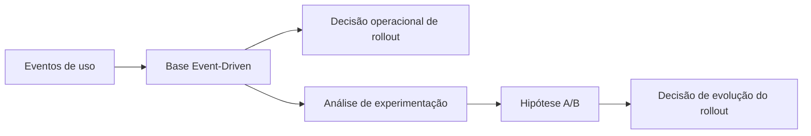
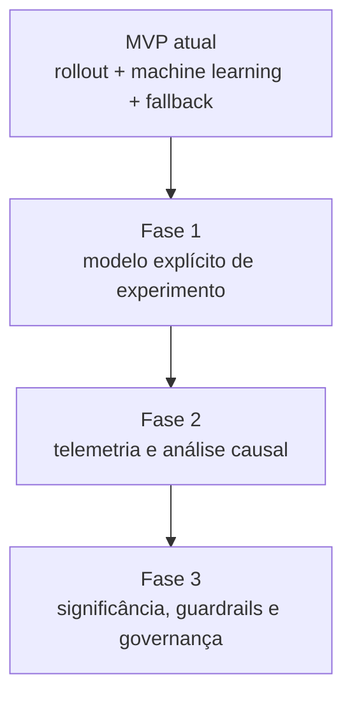

# Experimentação e Teste A/B

## Papel no projeto

O Adaptive Feature Flags nasce com foco em decisões de rollout orientadas por eventos (Event-Driven). A experimentação é parte central da evolução do produto, mas com escopo intencionalmente incremental no MVP.

## Relação entre Event-Driven e A/B testing

- **Event-Driven**: coleta e usa sinais comportamentais reais para apoiar decisões.
- **A/B testing**: compara variantes para medir impacto causal em métricas de negócio.

No contexto deste projeto, eventos são a base para ambos:

- Tomada de decisão operacional (habilitar ou não feature por usuário).
- Geração de evidências para experimentação e recomendação de rollout.

## O que o MVP já oferece para experimentação

- Rollout determinístico por percentual.
- Coleta e ingestão canônica de eventos.
- Avaliação por machine learning com fallback seguro.
- Recomendação estratégica de rollout por feature.

## O que ainda não é um framework A/B completo

- Gestão nativa de variantes (A/B/n) com alocação por experimento.
- Cálculo estatístico de significância e intervalos de confiança.
- Regras de parada automática e guardrails formais.
- Dashboard de experimentos, auditoria e governança avançada.

## Direção de evolução

1. Introduzir modelo explícito de experimento (experimento, variante, hipótese, métricas-alvo).
2. Padronizar telemetria para análise causal.
3. Adicionar avaliação estatística e critérios de decisão.
4. Integrar recomendação de rollout com estado do experimento.

## Mensagem de posicionamento

O projeto não concorre, nesta fase, com plataformas completas de experimentação. Ele estabelece a base técnica para decisões de rollout orientadas por eventos e prepara o caminho para capacidades mais robustas de teste A/B.
