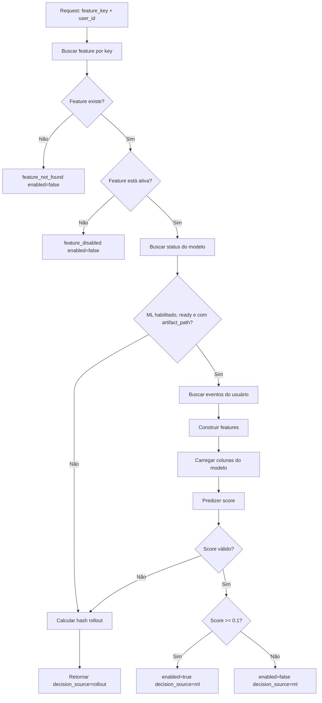
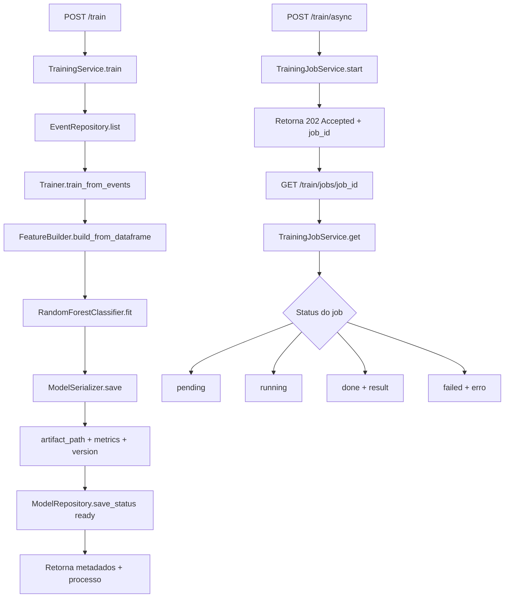

# Fluxo de decião: Rollout e Machine Learning (ML)

Este documento descreve como a API decide se uma feature sera habilitada para um usuario, combinando rollout deterministico e score de modelo.

## Objetivo

O sistema suporta dois mecanismos de decisao:

- Rollout deterministico por percentual (`rollout_percentage`)
- Decisao orientada por score de ML quando a feature permite (`ml_enabled`)

A avaliacao acontece no endpoint `POST /evaluate`.

## Componentes envolvidos

- `app/api/v1/routes/evaluate.py`: entrada HTTP da avaliacao.
- `app/domain/services/evaluation_service.py`: regra principal de decisao.
- `app/domain/services/training_service.py`: orquestracao de treino.
- `app/infrastructure/ml/trainer.py`: treinamento e persistencia do artefato.
- `app/infrastructure/ml/feature_builder.py`: engenharia de features para treino e inferencia.

## Pre-condicoes para decisao via ML

Para a decisao usar ML no `/evaluate`, todos os itens abaixo precisam ser verdadeiros:

1. A feature existe.
2. A feature esta habilitada (`enabled=true`).
3. A feature permite ML (`ml_enabled=true`).
4. O status do modelo esta `ready`.
5. Existe `artifact_path` no metadado do modelo.
6. O score de ML foi calculado com sucesso.

Se qualquer condicao falhar, a API usa rollout deterministico.

## Fluxo de decisao no /evaluate

Sequencia simplificada:

1. Buscar a feature por `feature_key`.
2. Se não existir: retorna `enabled=false` e `decision_source="feature_not_found"`.
3. Se existir mas estiver desabilitada: retorna `enabled=false` e `decision_source="feature_disabled"`.
4. Se `ml_enabled=true` e o modelo estiver pronto:
   - carrega eventos do usuario;
   - gera features com `FeatureBuilder`;
   - carrega colunas esperadas do artefato;
   - calcula score com `ModelPredictor`.
5. Se score valido: retorna `decision_source="ml"` e habilita quando `score >= 0.1`.
6. Se score estiver indisponivel/falhar: aplica rollout deterministico e retorna `decision_source="rollout"`.



## Como funciona o rollout deterministico

O rollout usa hash estável por par `(user_id, feature_key)`:

- calcula `sha256(f"{user_id}:{feature_key}")`
- converte parte do hash em bucket de `0..99`
- habilita quando `bucket < rollout_percentage`

Isso garante consistência: o mesmo usuário recebe sempre a mesma decisão para a mesma feature, enquanto o percentual permanecer igual.

## Treino do modelo (síncrono e assíncrono)

### Treino síncrono

- Endpoint: `POST /train`
- Fonte de dados: eventos persistidos
- Passos:
  - monta dataset por usuário via `FeatureBuilder`;
  - define alvo binário (`target`);
  - treina `RandomForestClassifier`;
  - calcula métricas (`accuracy`, `f1_score`);
  - salva artefato em `MODELS_DIR`;
  - atualiza `model_metadata` com status `ready`.

### Treino assíncrono

- Iniciar: `POST /train/async`
- Consultar: `GET /train/jobs/{job_id}`
- Status global de modelo: `GET /model/status`
- Persistencia de job: tabela `training_jobs` (SQLite)
- Durabilidade: status de job sobrevive a restart do processo da API
- Retenção: jobs antigos terminais (`succeeded`/`failed`) são removidos por política de tempo/capacidade

## Importacao de dataset para simulação

Para preparar ambiente de teste de ponta a ponta (eventos -> treino -> evaluate), use:

- Endpoint: `POST /simulate`
- Fonte de entrada: exatamente uma entre `csv_url` ou `csv_file` (multipart/form-data)
- Formato esperado: CSV estilo Retailrocket com colunas
  - `timestamp`
  - `visitorid`
  - `event`
  - `itemid`

Parametros principais:

- `feature_key_mode`:
  - `item` -> `feature_key=item_<itemid>`
  - `single` -> `feature_key=retailrocket_import`
- `sync_features` (default: `true`): auto-cria features ausentes
- `feature_rollout_percentage` (default: `10`)
- `feature_ml_enabled` (default: `true`)
- `limit`, `chunk_size`, `batch_size` para controle de volume/performance



## Condições de fallback para rollout

A API faz fallback para rollout quando:

- não há eventos para o usuário;
- não foi possível montar dataset de inferência;
- faltam colunas esperadas pelo artefato;
- ocorreu erro ao carregar artefato/modelo;
- ocorreu erro ao predizer score;
- modelo não está `ready` ou sem `artifact_path`.

Nesses casos, o endpoint continua respondendo com decisao valida usando rollout, evitando indisponibilidade da feature flag.

## Interpretacao do campo decision_source

Valores possíveis de `decision_source`:

- `feature_not_found`: chave de feature inexistente.
- `feature_disabled`: feature existe, mas está desligada.
- `ml`: decisão feita com score de modelo.
- `rollout`: decisão feita por percentual deterministico.

## Exemplo de chamada

```bash
curl -X POST "http://localhost:8000/evaluate" \
  -H "Content-Type: application/json" \
  -d '{"feature_key":"item_355908","user":{"user_id":"257597"}}'
```

Resposta (exemplo com ML):

```json
{
  "feature_key": "item_355908",
  "user_id": "257597",
  "enabled": true,
  "decision_source": "ml",
  "score": 0.42,
  "model_version": "v1"
}
```

Resposta (exemplo com fallback para rollout):

```json
{
  "feature_key": "item_355908",
  "user_id": "257597",
  "enabled": false,
  "decision_source": "rollout",
  "score": null,
  "model_version": null
}
```

## Operação recomendada

- Treinar novamente após mudanças relevantes de comportamento dos usuários.
- Monitorar `decision_source` em produção para acompanhar proporção `ml` vs `rollout`.
- Revisar periodicamente métricas e threshold de ativação de ML.
- Usar `scripts/test_model.py` para comparar ML vs baseline de rollout offline.
- Monitorar o volume de `training_jobs` e ajustar retenção se necessário para seu ambiente.
